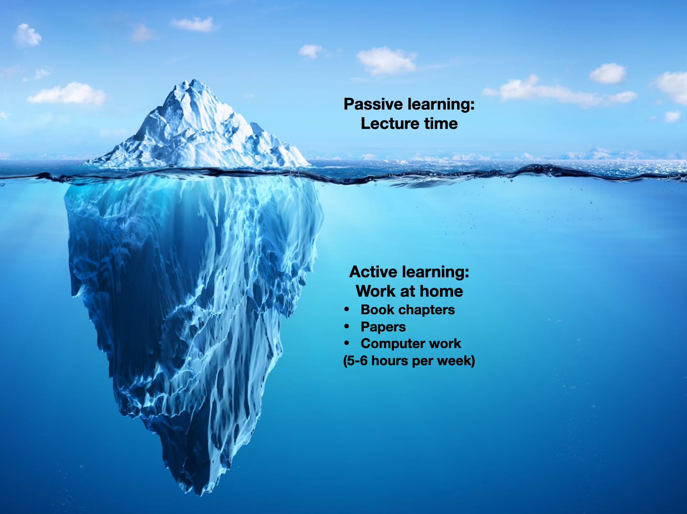

class: left, top

# Welcome to Botany/Plant Path 563: Phylogenetic Analysis of Molecular Data!

### Introductions
Let's start with short introductions: name, year, program and one word that describes how you feel at the beginning of 2025 (repetitions allowed).

---
class: left, top

## Class format

**What this class is...**
This class is meant to prepare students to perform state-of-the-art phylogenetic analyses. This class is very hands-on and students are expected to actively participate in class exercises and work at home. The ideal outcome of this class is a phylogenetics pipeline that can be used in the student's research.

**What this class is not...**
This class will not expect students to memorize formulas. There are no exams to assess the specific learning of concepts. The class will be graded via a final project where all topics will be applied on a real data analysis of the student's interest.

#### Structure
- Pre-class work: usually reading a chapter and complete an quiz (ungraded, but needs to be completed for credit)
- Lectures and in-class exercises (computational/paper discussions)
- Homework exercises: usually apply material in your own data
- Resources to learn more

---
class: left, top

### Iceberg: passive vs active learning

---
class: left, top

### Iceberg: passive vs active learning

- Bad news: This can be a time-consuming class
  - Selected comments from student evaluations
      - It would be nice to have more hours to practice the different programs/commands we treated in the course
      - I would suggest increasing the number of lecture hours; two days per week seemed a little short
      - I think the course could be divided into two courses in order to have time to explain the concepts well
  - For a 3-credit class, we only have two 75-minute classes per week.
- Good news: Time spent learning phylogenetics today will save you time when doing your own research
  - The measure of success is how much you learned
  - How much you learn is entirely up to you: more time dedicated at home, more learning
  - All materials are online for future reference
  - Grading: continuous formal assessments vs final project (more later)

---
class: left, top

## How do I take full advantage of the class?

1. Bring your own data to play with
2. Be reproducible from the start (more on reproducibility in lecture 2 and 3)
3. Read the material in preparation for the lectures (ungraded quizzes aim to help you keep up with readings)
4. Attend and actively participate in lecture and in-class activities
5. Join the slack workspace and actively engage in questions and answers (more on slack later)

---
class: left, top

## Class communication: Slack

Slack join link in canvas (expires on January 29th). Let's use this time to go over the workspace for those not familiar with slack.

Slack rules:

- Everyone can post in any channel, but try to post things on the right channel
- Feel free to reply to other people's questions (in fact, this is the main purpose of having slack for the class)
- Feel free to post any resources that you find helpful for your fellow students
- I cannot answer questions 24/7, but I am much more responsive in slack than by email

### First HW (very very important!):
- Join to slack (we can give some minutes today for people to do it)
- Post something in #botany563: cute photos of pets, question to engaged the community, short intro, favorite restaurant in Madison, favorite winter activity
- **Deadline:** Thursday January 23rd, before class.

---
class: left, top

## Grading

|  | Points |
| :--: | :--: |
| Formal assessments (quizzes/HWs) | 20 |
| GitHub commits | 10 |
| Final project | 50 |
| Final reproducible script | 10 |
| Final presentation | 10 |
| Total | 100 |

| Points | Grade |
| :--: | :--: |
| 70+ | B |
| 80+ | AB |
| 90+ | A |

---
class: left, top

## Grading

Formal assessments (canvas):
- Not graded: complete/incomplete
- Half the points for one week late submission
- You can miss 4 assessments without penalty

Github commits (canvas):
- To encourage work on your project since the beginning
- Not graded: complete/incomplete
- Half the points for one week late submission
- You can miss 2 assessments without penalty

Final report and reproducible:
- Up to one week late submission (for 20% point penalty)

Final presentation:
- No changes in dates
- If unable to attend on selected date, you can send a recording of your presentation

---
class: left, top

## Phylogenetics background

Let's see the level of the class on phylogenetics knowledge with [this short poll](https://pollev.com/claudiasolis197). Note to self: poll needs to the active.

---
class: left, top

## Ready-for-class checklist

- Join slack with the link in canvas
  - Post something by next class
- Access to class google shared drive (link in canvas). You should have received an email invitation
- Read the [syllabus](https://github.com/crsl4/phylogenetics-class/blob/master/syllabus.md) carefully
- Check out the [class repository](https://github.com/crsl4/phylogenetics-class)

---
class: left, top

## Learning values

To conclude class, let's do an exercise on learning values. Open this [shared google doc](https://docs.google.com/presentation/d/13qBipEwsCabUm7tlH6yLtASX6cziNZwuRbh7NjXTlQk/edit?usp=sharing).

## Questions?