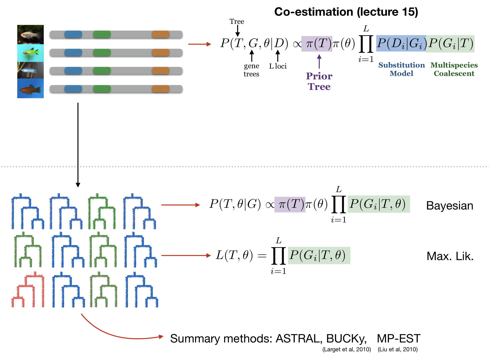

# Co-estimation Methods (Part 1)

### Previous class check-up
- We studied the theory of coalescent models on trees and on networks
- We studied ASTRAL, BUCKy and the PhyloNetworks pipeline from sequences to species tree/network

### Learning objectives

At the end of today's session, you will be able to
- identify the main parts of co-estimation methods
- follow the BEAST tutorial

### Pre-class work

- Optional reading HB 18

# Taming the BEAST 

[GitHub repo](https://github.com/Taming-the-BEAST/Taming-the-BEAST-2019-Eh-Lectures)

- [BEAST intro](https://github.com/Taming-the-BEAST/Taming-the-BEAST-2019-Eh-Lectures/blob/master/2019-08-12_Beast2Intro.pdf)
- [Setting priors](https://github.com/Taming-the-BEAST/Taming-the-BEAST-2019-Eh-Lectures/blob/master/2019-08-12_SettingPriors.pdf)
- [Troubleshooting](https://github.com/Taming-the-BEAST/Taming-the-BEAST-2019-Eh-Lectures/blob/master/2019-08-13_Troubleshooting.pdf)

Documentation to learn more in the future:
- [First tutorial](https://beast.community/first_tutorial) to run a simple BEAST analysis
- [Second tutorial](https://beast.community/second_tutorial) to interpret the results

