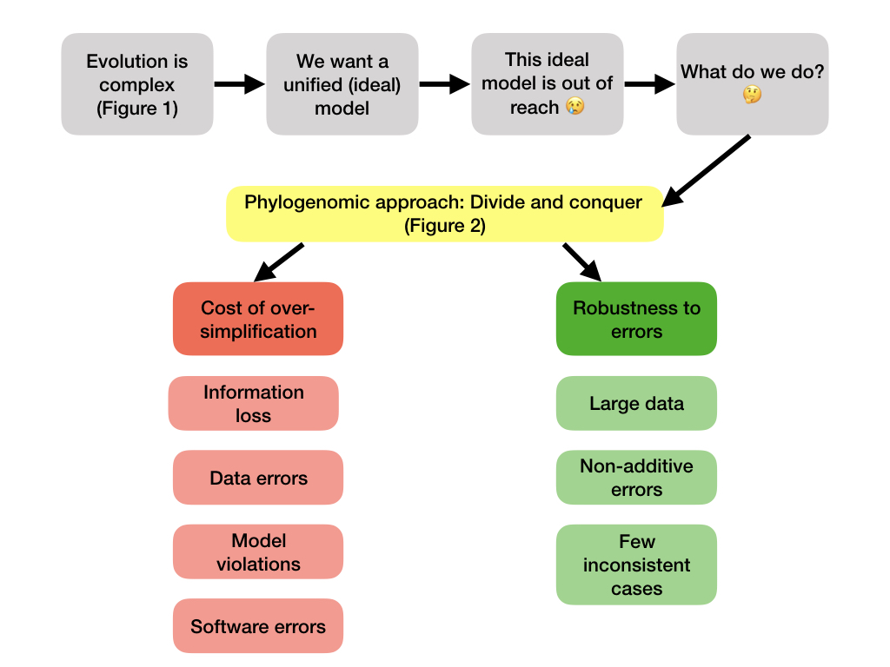
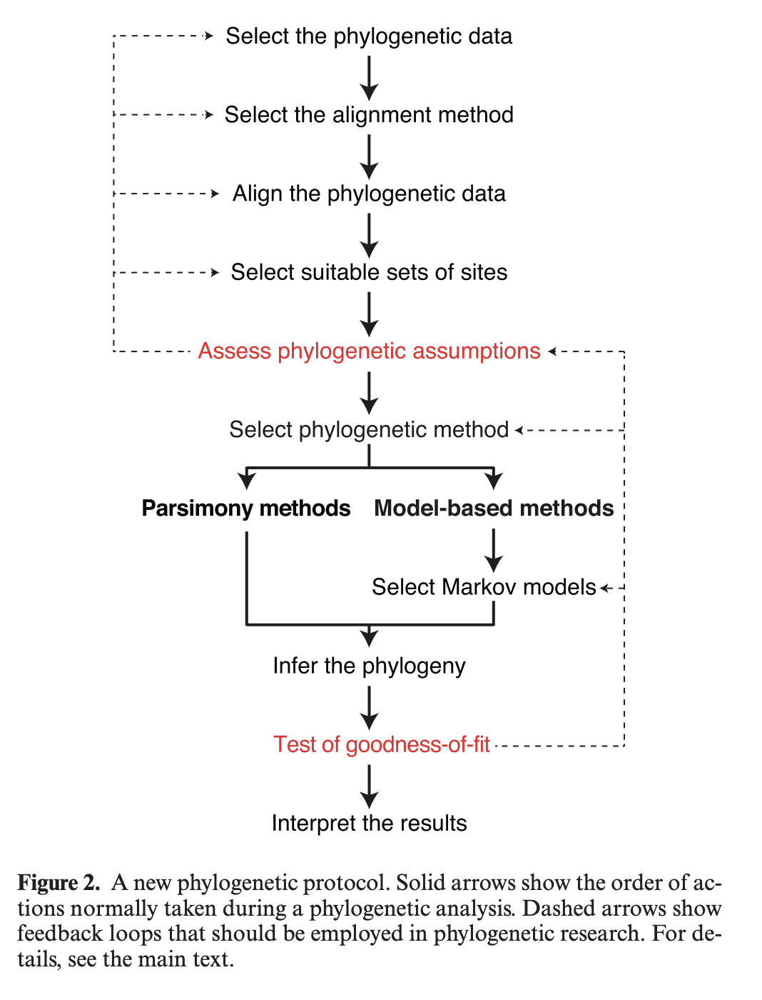

# What else is out there?

### [HAL 2.1] To What Extent Current Limits of Phylogenomics Can Be Overcome?

#### Concept flowchart

## Phylogenomic pipeline (HAL 2.1)

# What do we know now?

- Motivation: phylogenomics pipeline
    - Reading: HAL 2.1
- Intro Illumina, quality control, assembly, alignment, filtering
- Alignment
    - Reading: HAL 2.2, ClustalW, MUSCLE, T-coffee papers
    - Software: T-coffee, Clustal, Muscle
- Orthology detection
    - Reading: HAL 2.4, Nichio 2017
    - Software: Many options in class google slides!
- Overview of phylogenetic inference: criteria score, search in tree space
- Gene tree estimation
    1. Distance methods
        - Reading (supplemental): HB Ch 5, Baum Ch 8
        - Software: R packages ape, phangorn
    2. Parsimony methods
        - Reading (supplemental): HB Ch 8, Baum Ch 7
        - Software: R packages ape, phangorn
    3. Models of evolution
        - Reading: HAL 1.1
    4. Maximum likelihood
        - Reading: HAL 1.2, RAxML and IQ-Tree papers
        - Software: RAxML (HAL 1.3) and IQ-Tree
    5. Bayesian
        - Reading: HAL 1.4, Mascimento 2017, MrBayes papers
        - Software: MrBayes (HB Ch 7)
    6. Model selection (invited guest: Rob Lanfear developer of IQ-Tree)
- Species tree/network estimation: the coalescent model
    - Reading: HAL 3.1, 3.3, ASTRAL and BUCKy papers
    - Software: PhyloNetworks wiki pipeline (MDL, RAxML, MrBayes, BUCKy, ASTRAL, SNaQ)
- Co-estimation methods
    - Reading: BEAST papers
    - Taming the BEAST slides

## Main conclusions

- Phylogenomics is hard
- Importance of data quality and phylogenetic signal
- Importance of clear description of methods used, assumptions and limitations
  - Make sure that you know (in general) what the method you are using does
- Importance of model selection and model fit
- Importance of measures of confidence
  - No desperate quest for 100 bootstrap support values!
- Importance of reproducibility
  - Every choice matters, so keep good track of the choices
  
## Good news

- This was not the class to make you all experts in phylogenetics
- Class notes are publicly available on github forever
- Upcoming: lecture YouTube videos publicly available (Spring 2024)
- You have now your own notes in your personal github repository
- You can continue to have support from phylogenetics student community in slack (if you choose to remain in the workspace)

# Jermiin et al 2020

# What else is out there?

- Dating
    - Reading: HAL 5.1
    - Supplemental reading: HB Ch 11
    - Bayesian dating: [Bromham 2017](https://onlinelibrary.wiley.com/doi/full/10.1111/brv.12390)
    - Software
        - RevBayes
            - HAL 5.2 
            - [Workshop](https://revbayes.github.io/workshops/online2020.html)
            - [Tutorial](https://revbayes.github.io/tutorials/fbd_simple/)
        - [DivTime](https://github.com/mariodosreis/divtime)
        - [BEAST](https://taming-the-beast.org/tutorials/)
- Reconciliation 
    - Reading: HAL 3.2
- Species delimitation
    - Reading: HAL 5.5
    - Software:
        - BPP: HAL 5.6
        - iBPP (morphology and genes): https://github.com/cecileane/iBPP
- SNP methods
  - [SVDquartets](http://www.phylosolutions.com/tutorials/ssb2018/svdquartets-tutorial.html)
  - SNAPP
  - [SNAPPnet](http://charles-elie.rabier.pagesperso-orange.fr/doc/SnapNetFiles/tutoSnappNet.pdf)
  - PhyloNet
  

# Final housekeeping

- Project deadline: May 5th
  - Final project
  - Reproducible script
  - [Project guidelines](https://crsl4.github.io/phylogenetics-class/lecture-notes/project.html)
- Presentations: Apr 29 and May 1
  - 7-minute presentations (very strict!)
  - Please send me your slides at 12pm (or earlier) on the day you are presenting
- Official student evaluations
  - Forward me the email by May 5th to receive HW credit
- Class feedback google form (link on canvas and slack)
  - Highly appreciated
  - Less than 5 minutes to respond
- Advice for future students: [slides](https://docs.google.com/presentation/d/13qBipEwsCabUm7tlH6yLtASX6cziNZwuRbh7NjXTlQk/edit?usp=sharing)
