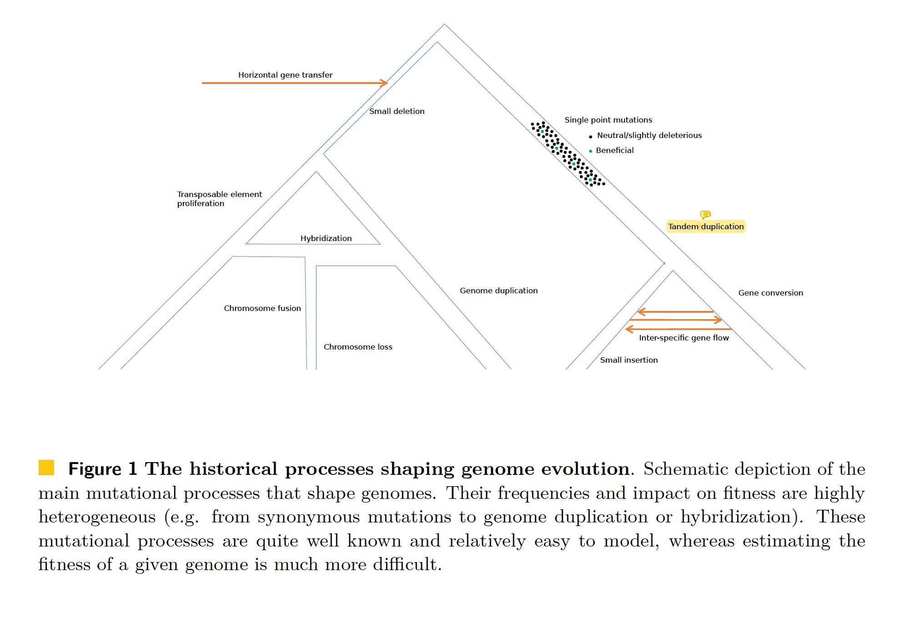

class: left, top

## Learning objectives for today

At the end of today's session, you will identify the different components in phylogenomic analyses.

## Pre-class reading

[HAL book chapter 2.1](https://hal.inria.fr/PGE/page/table-of-contents)

- Don't forget the canvas quiz!

# [HAL 2.1] To What Extent Current Limits of Phylogenomics Can Be Overcome?

#### Concept flowchart

## Evolution is complex (Figure 1, HAL 2.1, Simion et al 2020)

**Ideal evolutionary model:** theoretical model that accounts for all processes in a holistic manner. It is unrealistic and computationally prohibited, so we need divide-and-conquer and approximation approaches.

## Phylogenomic approach: divide-and-conquer (Figure 2, HAL 2.1, Simion et al 2020)

1. genome annotation, 
2. searching for homologous genes, 
3. defining orthologs, 
4. aligning homologous positions,
5. inferring species phylogeny (supermatrix or gene tree approaches), and 
6. reconciling single gene trees and the species phylogeny.

### 3. Inferring Orthologs
- Homology is similarity due to shared ancestry between a pair of structures or genes in different taxa.)
- The criteria for homology prediction is pairwise sequence similarity estimated using BLAST
- Orthology prediction often relies on 
    - homology inference (i.e. similarity searches), 
    - pairwise species comparisons or species-overlap concepts, 
    - sequence alignment,
    - gene genealogy inference, and 
    - even species tree inference or a priori knowledge of the species tree. 
- More on orthology prediction in HAL 2.4 and Lecture 6.

### 4. Producing alignments
Multiple homologous or orthologous sequences are then jointly aligned using one of the
many available sequence alignment software packages. More in HAL 2.2 and Lectures 4 and 5.

#### 5&6. Phylogenomic analyses
Two paths:

- reconciliation methods are used to jointly estimate gene trees and species trees by modeling
gene duplication-transfer-loss (DTL) events for the MSA of homologous sequences (HAL 3.2, not covered in class)
- species tree estimations from MSA of orthologous sequences accounting for incomplete lineage sorting
(ILS), introgression or lateral gene transfer

Concatenation debate (HAL 3.4 and class discussion session in late April):

- ILS is ignored in concatenation
- single-gene tree reconstruction: no signal for difficult nodes due to stochastic error (short internal branches)
- only considering the species tree is not appropriate for the study of trait evolution. [Hahn and Nakhleh (2015)](https://onlinelibrary.wiley.com/doi/full/10.1111/evo.12832) argue that we need to take into account the gene tre variability

**Chapter Conclusion:** We believe that concatenation seems therefore more adequate to resolve ancient phylogenetic
relationships or when the sampling is devoid of ultra-close speciation events, whereas the
use of single gene trees is more appropriate for more recent speciation events, even when
closely-spaced in time.

## Cost of over-simplification

- Information loss
    - homology search assumes that sequences were generated under a star-tree topology with equal branch lengths
    - the model used to quantify similarity implicitly assumes that every position evolves at the same rate and that at most a single substitution has occurred at a given position

- Data errors
    - Genome annotation errors
        - often assumes that genomes do not have any evolutionary history
        - current annotation methods do not model chromosome structure, protein folding or interaction with other genomic regions

- Model violations
    - Sequence alignment model violations
        - overlooking sequence function and protein structure, species-specific recombination hotspots and lineage-specific evolutionary rates
        - indels considered characters instead of historical events
    - Unrealistic phylogenomic inference models
        - ignore lineage-specific composition heterogeneity,
        - ignore site-specific substitution process heterogeneity, 
        - heterogeneity of site-specific substitution process among lineages (i.e. heteropecilly)
        - _Def._ Heterotachy refers to variations in lineage-specific evolutionary rates over time. In the field of molecular evolution, the principle of heterotachy states that the substitution rate of sites in a gene can change through time.

- Software errors
    - script/software does not produce the intended results

## Types of error

### Observational errors during data acquisition and production
- data that are not what the user believes they are
- contamination from organisms other than the target
- cross-contamination between samples during sequencing data production
- sequencing and assembly errors
- fragmented transcriptomic contigs thought to be entire transcripts
- gene exons thought to correspond to entire genes
- gene introns thought to correspond to exons
- amino acid sequences translated out of frame (i.e. frameshifts)
- Evaluating phylogenomic datasets: 
    - Looking beyond summary statistics (numbers of genes and
species) in these phylogenomic datasets can reveal various levels of data quality (e.g. measured with the Robinson-Foulds distance between gene trees and species trees), with orders of magnitude difference in data quantity
    - Data quality governs the crucial phylogenetic signal-to-noise ratio upon which
the accuracy of the inferred species tree strongly depends

## Types of error

### Orthology errors
- Pairs of homologous sequences have different potential relationships:
they can be orthologous (i.e. stemming from speciation), paralogous (i.e. stemming from duplication)
or xenologous (i.e. stemming from horizontal transfer)
- Incomplete taxonomic sampling complicates the detection of xenologs
- Inaccurate gene tree inference can hamper the classification of two sequences
as orthologous (e.g. if only one of them evolved rapidly)

### Phylogenetic inference simplifying assumptions
- All sites evolved at the same rate? No -> Gamma component in models
- All sites evolve under the same substitution process? No -> Site-heterogeneous CAT models
- Variations in lineage-specific evolutionary rates over time (heterotachy)? Yes -> GHOST models implemented in IQ-TREE in order to model 
- Ever-evolving models: 
    - CAT models to phenomenologically account for protein structure and function
    - Compositional breakpoints (BP) to account for heterogeneity in the substitution process across lineages
    - Site-heterogeneous codon models (SelAC) to model stabilising selection

- **Further reading:** [Wang et al, 2019](https://academic.oup.com/sysbio/article/68/6/1003/5477411) assessed the impact of modelling site-heterogeneity (heterogeneity in substitution patterns amongst the sites, genes and lineages: mixture models) versus partition-wide heterotachy
and convincingly concluded that modelling site-heterogeneity was more important
than modelling partition-wide heterotachy

## Robustness to errors

- Large data
    - Phylogenetic signal is additive

- Non-additive errors
    - Various randomly distributed errors will only produce non-additive signals

- Few inconsistent cases in the ToL
    - phylogenomic inconsistency due to short internal branches
    - rapid diversification on ancient speciation events
    - progressive loss of signal through multiple substitutions

## Conclusions
- Importance of data quality and model/software choices
    - Data quality usually slipped under the rug
- Methods people: ever-evolving landscape of new models
    - Questions for us: What are the assumptions and limitations? (More on Lecture 9)
- Don't disregard potential software error
- Interesting notion of computational footprint

### Three questions moving forward in phylogenomics
- How good is my data?
- What are the assumptions and limitations of this method?
- How do I evaluate the outcome?

# Wrapping-up class

## Post-class work

- Re-read HAL 2.1
    - Canvas quiz
- Read the new phylogenetic protocol [Jermiin et al 2020](https://academic.oup.com/nargab/article/2/2/lqaa041/5861483)
    - Goal is not to fully understand it
    - Read with relaxed state of mind: what is the main idea?
    - We will re-read and discuss this paper by the end of the semester

  
## Cited papers in this lecture
- [Foster et al, 2020](http://dx.doi.org/10.1073/pnas.2004999117)
- [Sanchez-Pacheco et al, 2020](https://www.pnas.org/content/117/23/12518)
- [Mavian et al, 2020](http://dx.doi.org/10.1073/pnas.2007295117)
- [Foster et al, 2020](https://www.pnas.org/content/117/23/12524)
- [Morel et al, 2020](https://pubmed.ncbi.nlm.nih.gov/33316067/)
- [Hahn and Nakhleh (2015)](https://onlinelibrary.wiley.com/doi/full/10.1111/evo.12832)
- [Wang et al, 2019](https://academic.oup.com/sysbio/article/68/6/1003/5477411)
- [Jermiin et al 2020](https://academic.oup.com/nargab/article/2/2/lqaa041/5861483)