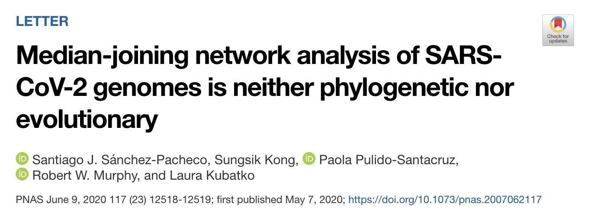
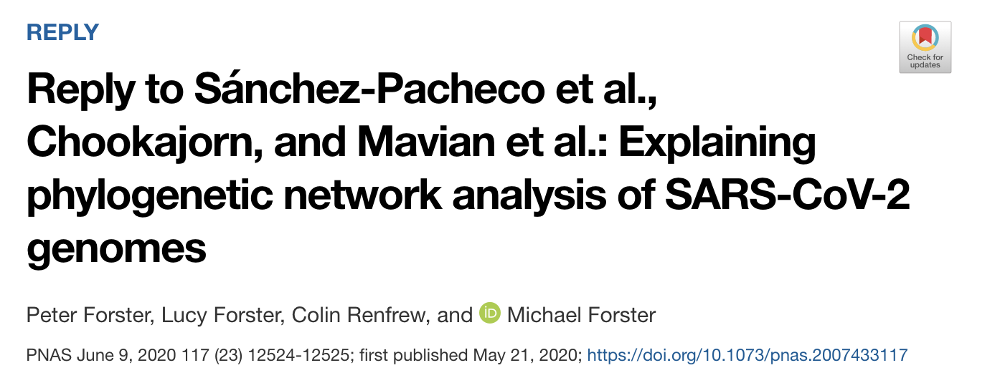
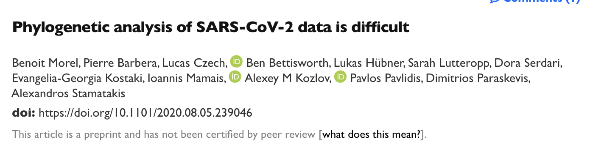

class: left, top

# Lecture 2

## Last class check-up:
- Everybody knows where the class materials are
- Everybody is included in slack and is able to send/receive messages (we will do a test after class)

## Learning objectives for today

At the end of today's session, you will identify the different components in phylogenomic analyses.

## Pre-class reading

[HAL book chapter 2.1](https://hal.inria.fr/PGE/page/table-of-contents)

---
class: left, top

## The story of the conundrum of the evolution of COVID19 in four acts

  
   

---
class: left, top

- Median-joining network (MJN) is not a phylogenetic network
- MJN are constructed with a distance-basec criteria: not suitable for modeling the mutational process in viruses

---
class: left, top

- Distant outgroup (sequence identity between SARS-CoV-2 and the bat virus is only 96.2%)

---
class: left, top

---
class: left, top

## To sum up...

---
class: left, top

### [HAL 2.1] To What Extent Current Limits of Phylogenomics Can Be Overcome?

#### Concept flowchart

---
class: left, top

## Main figures in chapter

---
class: left, top

## Main figures in chapter

---
class: left, top

## Cost of over-simplification

- Information loss
    - homology search assumes that sequences were generated under a star-tree topology with equal branch lengths
    - the model used to quantify similarity implicitly assumes that every position evolves at the same rate and that at most a single substitution has occurred at a given position

- Data errors
    - Genome annotation errors
        - often assumes that genomes do not have any evolutionary history
        - current annotation methods do not model chromosome structure, protein folding or interaction with other genomic regions

---
class: left, top

## Cost of over-simplification

- Model violations
    - Sequence alignment model violations
        - overlooking sequence function and protein structure, species-specific recombination hotspots and lineage-specific evolutionary rates
        - indels considered characters instead of historical events
    - Unrealistic phylogenomic inference models
        - ignore lineage-specific composition heterogeneity,
        - ignore site-specific substitution process heterogeneity, 
        - heterogeneity of site-specific substitution process among lineages (i.e. heteropecilly)
        - _Def._ Heterotachy refers to variations in lineage-specific evolutionary rates over time. In the field of molecular evolution, the principle of heterotachy states that the substitution rate of sites in a gene can change through time.

- Software errors
    - script/software does not produce the intended results

---
class: left, top

## Robustness to errors

- Large data
    - Phylogenetic signal is additive

- Non-additive errors
    - Various randomly distributed errors will only produce non-additive signals

- Few inconsistent cases in the ToL
    - phylogenomic inconsistency due to short internal branches
    - rapid diversification on ancient speciation events
    - progressive loss of signal through multiple substitutions

---
class: left, top

## Conclusions
- Importance of data quality and model/software choices
- Methods people: we need better models (joint if possible)
- Don't disregard potential software error
- Interesting notion of computational footprint

Further reading: [HAL 2.1 chapter notes](https://github.com/crsl4/phylogenetics-class/blob/master/lecture-notes/lecture2-chapter-notes.md)

---
class: left, top

# In-class exercise: Case studies in HAL 2.1

**Time:** 20 minutes in breakout rooms and 10 minutes for presentations (5 minutes per group)

**Instructions:** In breakout rooms, review the case study assign to your group and design a 5-minute presentation for the whole class where you answer the question: Which specific cost of over-simplification is illustrated in this case study and what tools were used to address it? Connect your answer to the concepts in the [Concept Flowchart](#concept-flowchart).

**Case studies** in [HAL 2.1](https://hal.inria.fr/PGE/hal-02535366) Section 4:

- Group 1 will go over Case Study in 4.1
- Group 2 will go over Case Study in 4.2

**Presentation slides:** Use [these google slides](https://docs.google.com/presentation/d/1kiFcuAt9MpmynXc-PFocqX4RTFmb3VtMMr_S0XZJ_R0/edit?usp=sharing) to plan your presentations. Select a note-taker from each group to write on the slides (suggestion: choose the person whose first name would be the first on an alphabetically sorted list).

  
