class: left, top

# Lecture 4

### Previous class check-up
- We are familiar with git/github
- We understand the importance of reproducible scripts

### Learning objectives

At the end of today's session, you
- will be able to explain the next-generation sequencing pipeline and post-processing bioinformatics steps
- will examine the advantages of targeted sequencing of ultra-conserved elements (UCEs) in phylogenomics
- will learn to use [phyluce](https://phyluce.readthedocs.io/en/latest/index.html): a software for UCE phylogenomics

### Pre-class work

- Watch these 5-minute youtube videos on next-generation sequencing: [video1](https://www.youtube.com/watch?v=CZeN-IgjYCo) and [video2](https://www.youtube.com/watch?v=fCd6B5HRaZ8)
- Read [Zhang et al, 2019](https://academic.oup.com/isd/article/3/5/3/5573097)

---
class: left, top

# DNA sequencing

DNA sequencing is the process of reading the nucleotides that comprise a DNA molecule (e.g. “GCAAACCAAT” is a 10-nucleotide DNA string)

Genomics sequencing:
- whole genome sequencing
- exome sequencing
- de novo sequencing (no reference sequence for alignment)
- targeted sequencing

Transcriptomics:
- total RNA, mRNA sequencing
- targeted RNA sequencing
- small RNA and noncoding RNA sequencing

Epigenomics:
- methylation sequencing
- ChIP sequencing
- ribosome profiling

---
class: left, top

## Pipeline

1. Sequencing (NGS)
    - Library preparation
    - Cluster amplification
    - Sequencing
    - (Demultiplex)
2. Quality Control
3. Read trimming
4. Alignment/mapping or de novo assembly

---
class: left, top

### 1. Sequencing

- NGS most commonly used nowadays
- [When to use NGS vs Sanger sequencing?](https://www.illumina.com/science/technology/next-generation-sequencing/ngs-vs-sanger-sequencing.html)
- [Illumina Intro to NGS](https://www.illumina.com/content/dam/illumina-marketing/documents/products/illumina_sequencing_introduction.pdf)

---
class: left, top

### 1. Sequencing

<div style="text-align:center"></div>

_Illumina intro pdf_

---
class: left, top

#### 1.1 Library preparation

<div style="text-align:center">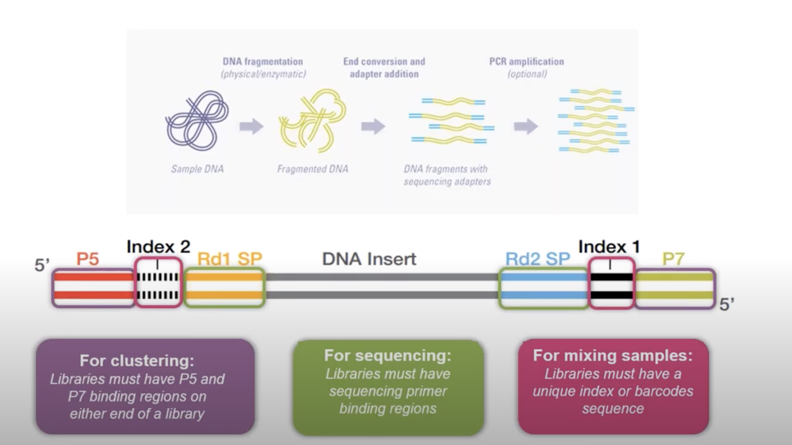</div>

_Illumina intro pdf_


---
class: left, top

#### 1.1 Library preparation

- The sequencing library is prepared by random fragmentation of the DNA or cDNA sample followed by 5′and 3′adapter ligation: "adapter-ligated fragments"
- Ingredients:
    - Read 1 and Read 2 Sequencing Primers: paired end sequencing
    - Libraries must have unique index or barcodes: dual indexing scheme
    - P5 and P7 adapter (binding regions)


---
class: left, top

#### 1.2 Cluster amplification

Fragments capture by oligonucleotides (_Image by Henrik's lab_)

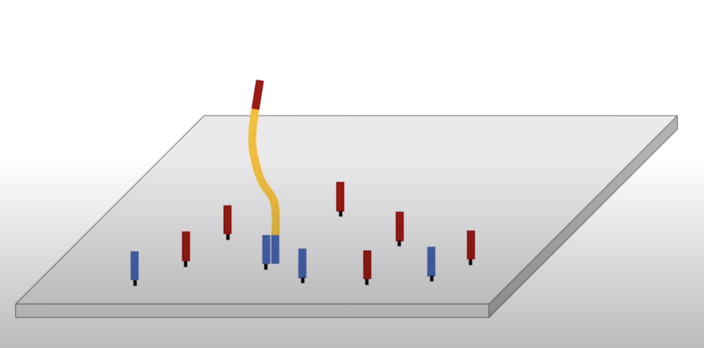


---
class: left, top

DNA polymerase binds to primers and synthetize a complementary sequence

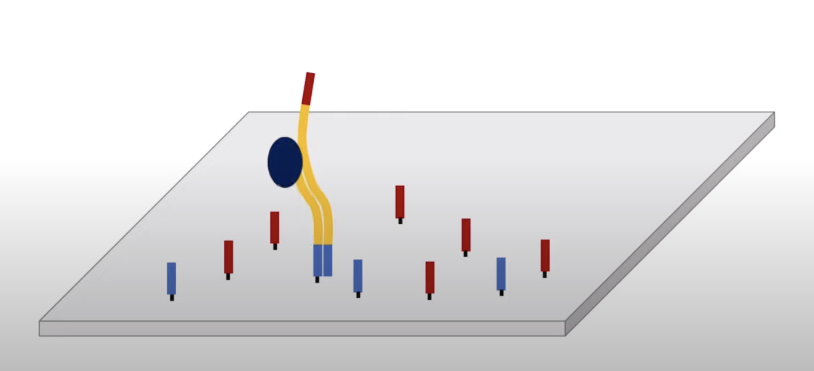

_Image by Henrik's lab_

---
class: left, top

Denatured and washing

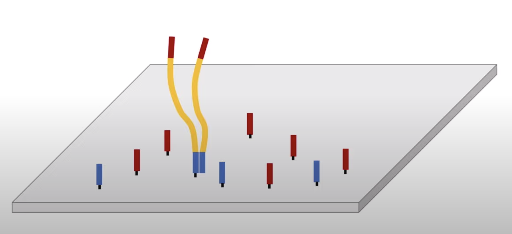

_Image by Henrik's lab_

---
class: left, top

Bridge building

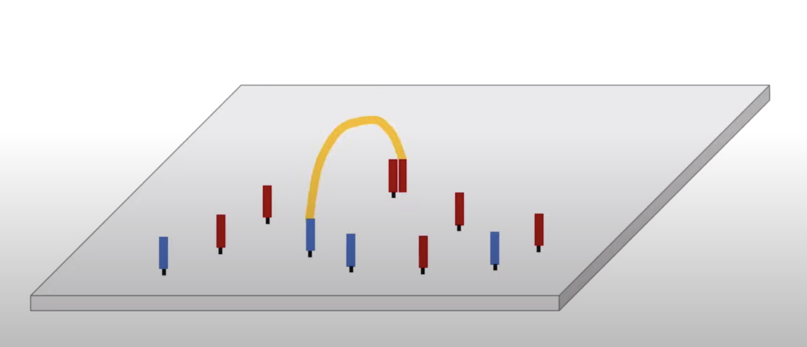

_Image by Henrik's lab_

---
class: left, top

Polymerase synthesizing again

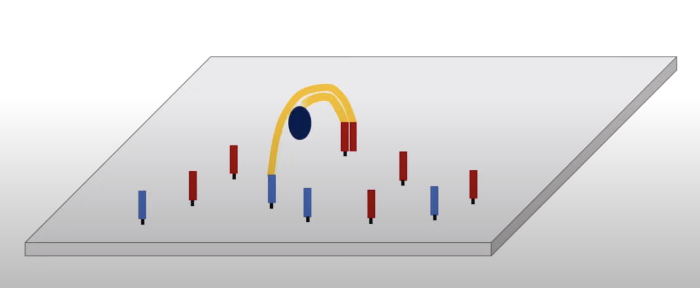

_Image by Henrik's lab_

---
class: left, top

Bridge amplification

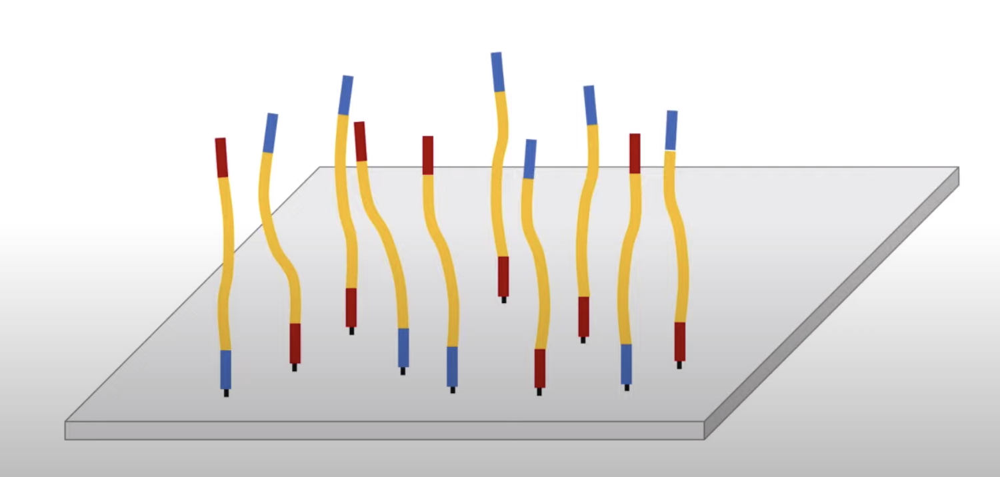

_Image by Henrik's lab_

---
class: left, top

Forward strands are kept

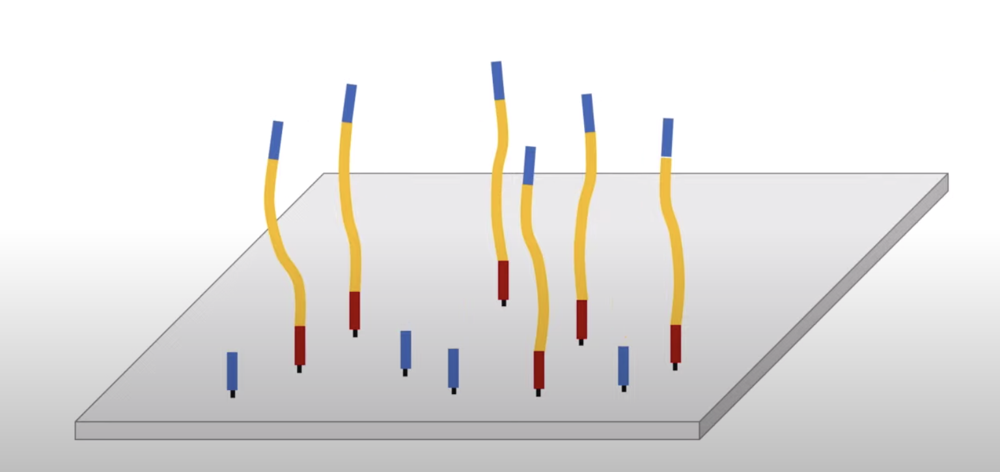

_Image by Henrik's lab_

---
class: left, top

##### Summary
- For cluster generation, the library is loaded into a flow cell where fragments are captured on a lawn of surface-bound oligos complementary to the library adapters
- Each fragment is then amplified into distinct, clonal clusters
through bridge amplification
- When cluster generation is complete, the templates are ready for sequencing.

---
class: left, top

#### 1.3 Sequencing

Primer attached and fluorescently labeled nucleotide added by polymerase. Flurescent signal is obtained by laser.

<div style="text-align:center">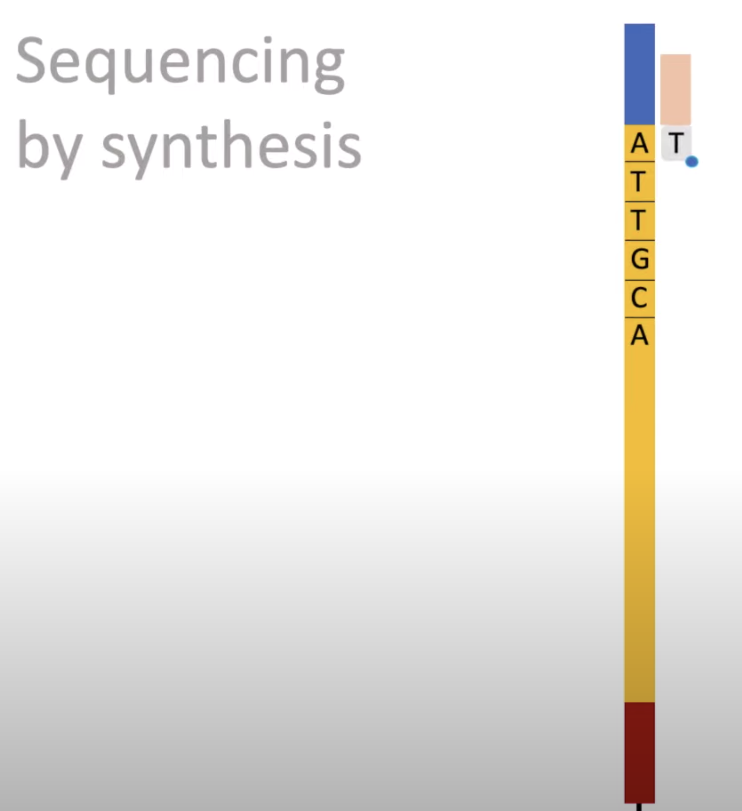</div>

_Image by Medical Science Animations_

---
class: left, top

##### Summary

_Illumina SBS technology uses a proprietary reversible terminator–based method that detects single bases
as they are incorporated into DNA template strands. As all four reversible terminator–bound dNTPs are
present during each sequencing cycle, natural competition minimizes incorporation bias and greatly reduces raw error
rates compared to other technologies. The result is highly accurate base-by-base sequencing that virtually eliminates
sequence context–specific errors, even within repetitive sequence regions and homopolymers._

[Illumina Intro to NGS](https://www.illumina.com/content/dam/illumina-marketing/documents/products/illumina_sequencing_introduction.pdf)

---
class: left, top

##### Advances in sequencing technology

Paired-end sequencing: (_Illumina intro pdf_)

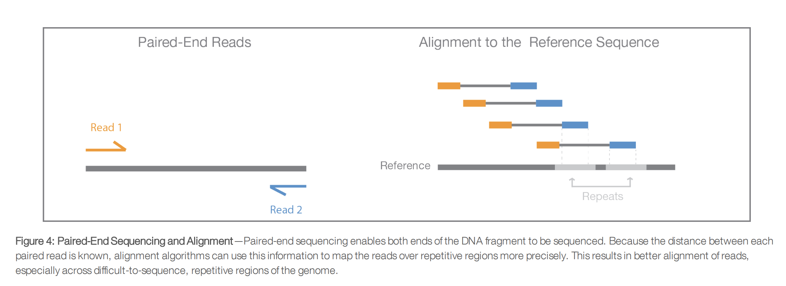

Learn more in this [video1](https://www.youtube.com/watch?v=f5DdKUGAuZE) and [video2](https://www.youtube.com/watch?v=WneZp3fSJIk)

---
class: left, top

Multiplexing

- Multiplexing
allows large numbers of libraries to be pooled and sequenced simultaneously during a single sequencing run
- You need to demultiplex prior to analysis
- The phenomenon of index misassignment between multiplexed libraries is a known issue

---
class: left, top

Multiplexing: (_Illumina intro pdf_)

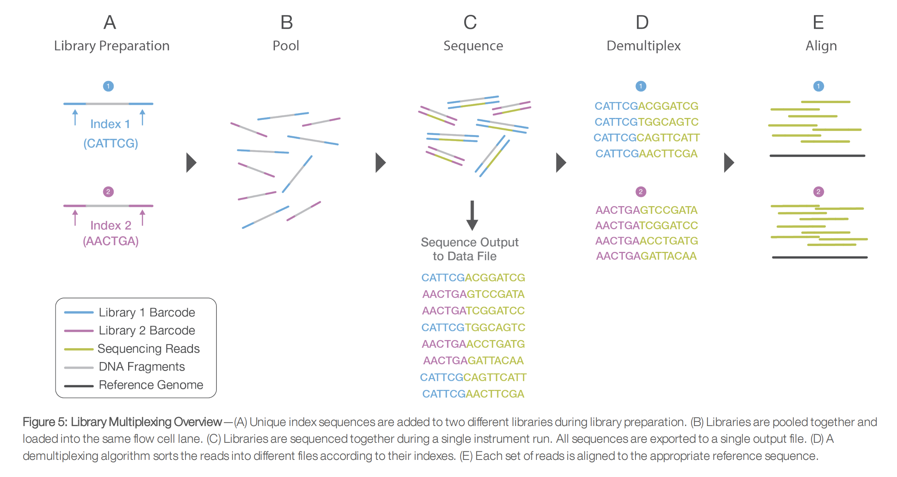

---
class: left, top

##### Output of sequencing

- Raw reads are stored in a [FASTQ](https://en.wikipedia.org/wiki/FASTQ_format#) file
    - Line 1: sequence identifier beginning with `@`
    - Line 2: raw sequence
    - Line 3: optional identifier or description beginning with `+`
    - Line 4: quality values of the sequence (byte-represented) from lowest quality (`0x21=!`) to highest quality (`0x7e=~`)

Example: 
```
@SEQ_ID
GATTTGGGGTTCAAAGCAGTATCGATCAAATAGTAAATCCATTTGTTCAACTCACAGTTT
+
!''*((((***+))%%%++)(%%%%).1***-+*''))**55CCF>>>>>>CCCCCCC65
```

Quality values:
```
!"#$%&'()*+,-./0123456789:;<=>?@ABCDEFGHIJKLMNOPQRSTUVWXYZ[\]^_`abcdefghijklmnopqrstuvwxyz{|}~
```

- The quality score of a base (known as [Phred](https://en.wikipedia.org/wiki/Phred_quality_score) or Q score) is an integer value representing the estimated probability of error
- Let `P` be the error probability $P=10^{-Q/10}$. Then, $Q=-10log_{10}(P)$

---
class: left, top

##### Illumina sequence identifiers

Example:
```
@HWUSI-EAS100R:6:73:941:1973#0/1
```

- `HWUSI-EAS100R`: the unique instrument name
- `6`: flowcell lane
- `73`: tile number within the flowcell lane
- `941`: x-coordinate of the cluster within the tile
- `1973`: y-coordinate of the cluster within the tile
- `#NNNNNN`: index number for a multiplexed sample (`#0` for no indexing)
- `/1`: the member of a pair, /1 or /2 (paired-end or mate-pair reads only)

Recent Illumina versions might have different identifier formats.

---
class: left, top

### 2. Quality Control (QC)

- We want to assess whether samples have good quality and can be used in further analysis
- [FastQC](https://www.bioinformatics.babraham.ac.uk/projects/fastqc/) is a software that reads the raw sequence (fastq file) as input and returns a html output file with key summary statistics about the quality
- [MultiQC](https://multiqc.info/) is a software that aggregates the multiple html reports from FastQC
- Sadly, there is not a consensus threshold on the FastQC metrics to classify samples as good or bad quality
- [From this bioinformatics blog](https://www.kolabtree.com/blog/a-step-by-step-guide-to-dna-sequencing-data-analysis/): _I expect all samples that have gone through the same procedure (e.g. DNA extraction, library preparation) to have similar quality statistics and a majority of “pass” flags_

---
class: left, top

### 3. Read trimming

- QC helps to identify problematic samples but it does not improve the actual quality of the reads. To do so, we need to trim reads to remove technical sequences and low-quality ends
- In short-read sequencing, the DNA sequence is determined one nucleotide at a time (technically, one nucleotide every sequencing cycle)
- A known issue of sequencing methods is the decay of the accuracy with which nucleotides are determined as sequencing cycles accumulate
- [Cutadapt](https://cutadapt.readthedocs.io/en/stable/) is a widely used software for read trimming and quality control that is open-source, well-documented and easy to use
- [From this bioinformatics blog](https://www.kolabtree.com/blog/a-step-by-step-guide-to-dna-sequencing-data-analysis/): _I typically re-run FastQC on the trimmed reads to check that this step was effective and systematically improved the QC metrics_

---
class: left, top

### 4. Alignment (mapping to reference genome)

- Read alignment determines the position in the genome from which the sequence of the read derived
- At this step we require a reference sequence to align/map the reads on
- While the number of species with a high-quality reference sequence is increasing, there are still under-studied organisms
- For these cases, we align/map the reads to an evolutionary close species

---
class: left, top

#### De novo assembly
- [De novo sequence assemblers](https://en.wikipedia.org/wiki/De_novo_sequence_assemblers) are a type of program that assembles short nucleotide sequences into longer ones without the use of a reference genome
- Typically, you need a combination of short and long read to assemble

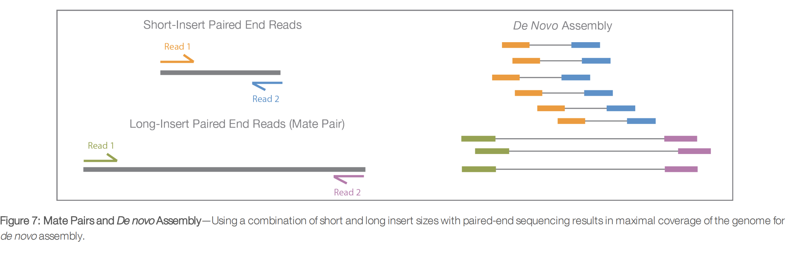

_Illumina intro pdf_

---
class: left, top

##### Assemblathon 2
- [Bradnam et al, 2013: Assemblathon 2](https://www.ncbi.nlm.nih.gov/pmc/articles/PMC3844414/)
- They used genomes of multiples vertebrates: a bird (_Melopsittacus undulatus_), a fish (_Maylandia zebra_), and a snake (_Boa constrictor constrictor_) with genomes of length 1.2, 1.0, and 1.6Gbp respectively
- They used over 100 metrics to assess the quality of standard de novo assemblers
- Each team was given four months to assemble their genome from Next-Generation Sequence (NGS) data, including Illumina and Roche 454 sequence data
- Their recommendations:
    1. use more than one assembler,
    2. use more than one metric for evaluation,
    3. select an assembler that excels in metrics of more interest (e.g., N50, coverage)
    4. low N50s or assembly sizes may not be concerning, depending on user needs, and 
    5. assess the levels of heterozygosity in the genome of interest

---
class: left, top

# Targeted enrichment of ultraconserved elements (UCEs)

## Targeted sequencing

- Approaches like ‘genome reduction’ or ‘reduced representation’ can generate datasets with thousands of loci at relatively low cost for model and non-model taxa
- We will focus on Targeted enrichment of ultraconserved elements (UCEs) from the [Zhang et al 2019](https://academic.oup.com/isd/article/3/5/3/5573097) paper
- Ultraconserved Elements are highly conserved regions within the genome that are shared among evolutionarily distant taxa
- The DNA adjacent to each ‘core’ UCE region, known as flanking DNA, increases in variability with distance from the region
- The UCE approach belongs to the broad category of ‘target enrichment’ phylogenomic techniques: anchored hybrid enrichment (AHE) or target capture of Ultraconserved Elements (UCEs)
- The advantage of the UCE approach is that it is fully open source, see [phyluce](https://phyluce.readthedocs.io/en/latest/index.html)

---
class: left, top

## Targeted sequencing

<div style="text-align:center">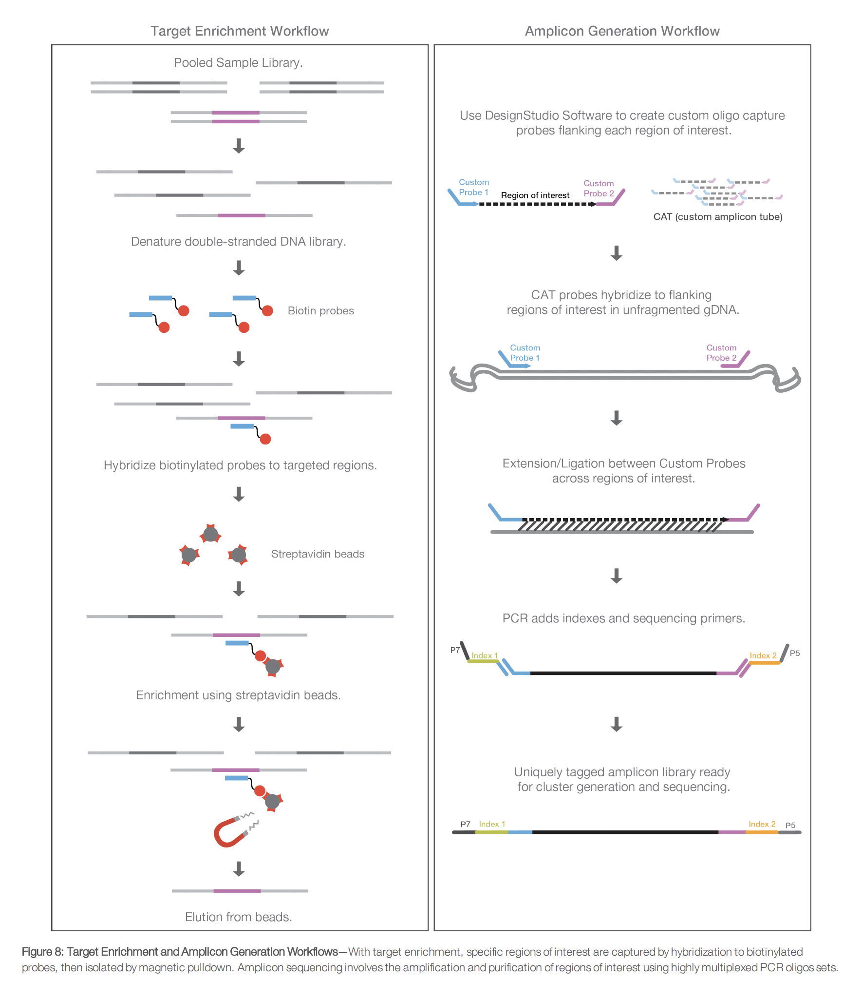</div>

_Illumina intro pdf_


---
class: left, top

## UCE flowchart 
_Fig.2 Zhang et al 2019_

<div style="text-align:center">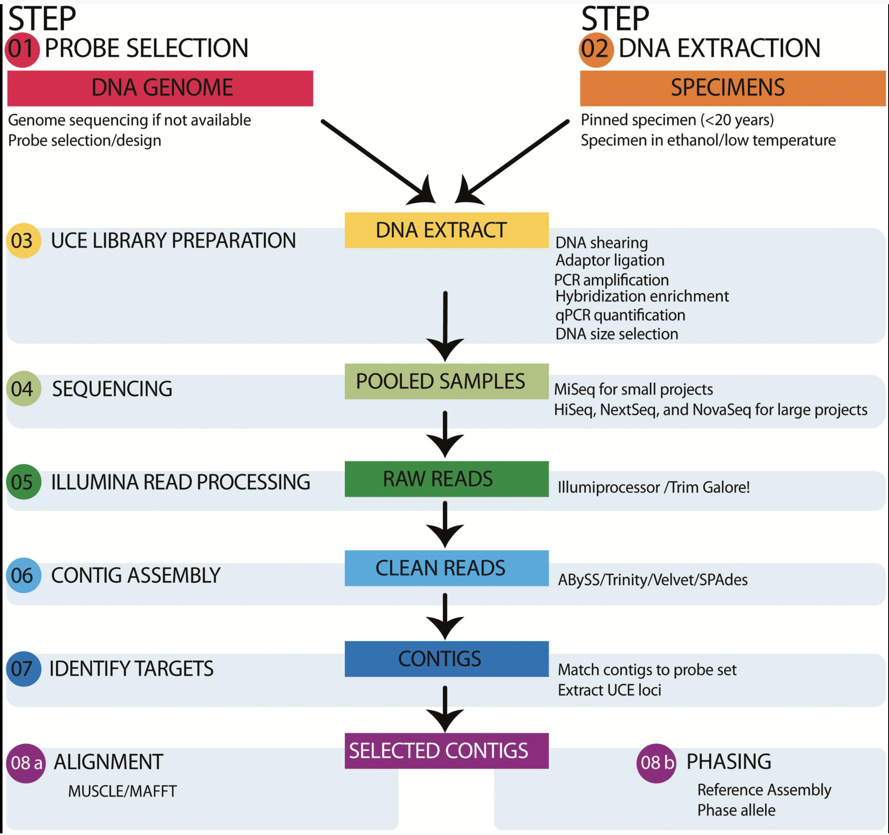</div>


---
class: left, top

## UCE Phylogenomic analyses

- Data Filtering: quality control
- Data Partitioning: 
    1. assign all UCE loci to a single partition (this assumes that every site in the alignment has evolved under a common evolutionary process); 
    2. assign each UCE locus to a separate partition (this allows for variation in rates and patterns of evolution between UCEs but assumes that all sites within each UCE locus have evolved under the same Markov process);
    3. k-means clustering of sites based on evolutionary rates which subdivides data into partitions based on evolutionary rates, thus avoiding a priori partitioning by the user
- Tree building

---
class: left, top

# In-class group activity

**Objective:** Install and learn how to use [phyluce](https://phyluce.readthedocs.io/en/latest/index.html) for UCE phylogenomics

**Time:** 20-25 minutes (?)

**Instructions:** We will go over together the next two sections:

- [Installation](https://phyluce.readthedocs.io/en/latest/installation.html)
- [Tutorial I](https://phyluce.readthedocs.io/en/latest/tutorial-one.html)

and create our own reproducible script.

**Disclaimer:** I have not done the steps ahead of time to make sure that everything runs smoothly. My idea is to troubleshoot this pipeline together, but maybe this will backfire.

#### Options for you

1. "I think that I can follow the pipeline by myself or with a small group of peers": you can join the Congregate room
2. "I need to see step by step": you can stay here in the zoom room

---
class: left, top

# Homework

1. Identify which dataset you will use for the rest of the semester: This data can be related to your research or it can be a public dataset
2. Create your reproducible notebook (preferably md format) and push to your github repository
3. Add a short description of your dataset to your notebook and add one slide describing your dataset to share with the class in the [class google slides](https://docs.google.com/presentation/d/1-DRevm_ntBOD6F5PMnQkzbMuhSiJMjjaBiD8FvUhfY4/edit?usp=sharing)
4. Identify the stage of your dataset
    - Do you have raw reads? Perform the quality control steps that we described
    - Do you have UCEs? Use `phyluce` for quality control, assembly and mapping
5. Make sure to record all steps taken with the data in your reproducible notebook and push the most updated version to github

---
class: left, top

# More resources

- To read about the whole bioinformatics pipeline, see [this blog](https://www.kolabtree.com/blog/a-step-by-step-guide-to-dna-sequencing-data-analysis/) by Kolabtree or this [Genomics tutorial](https://genomics.sschmeier.com/introduction.html) by Sebastian Schmeier
- To learn more about Sanger sequencing technology, watch these two YouTube videos (less than 5 minutes each): [video1](https://www.youtube.com/watch?v=ONGdehkB8jU) and [video2](https://www.youtube.com/watch?v=Jnk_4Maf5Fk)
- To learn a lot more details about NGS technology, read [this pdf](https://www.illumina.com/content/dam/illumina-marketing/documents/products/illumina_sequencing_introduction.pdf). Watch this 50-minute youtube [video](https://www.youtube.com/watch?v=6jf_6STEnI4) and this shorter 5-minute youtube [video](https://www.youtube.com/watch?v=shoje_9IYWc)

## Papers to read
- Shendure et al, 2017 [DNA sequencing at 40: past, present and future](https://www.nature.com/articles/nature24286)
- Shendure and Ji, 2008 [Next-generation DNA sequencing](https://www.nature.com/articles/nbt1486)