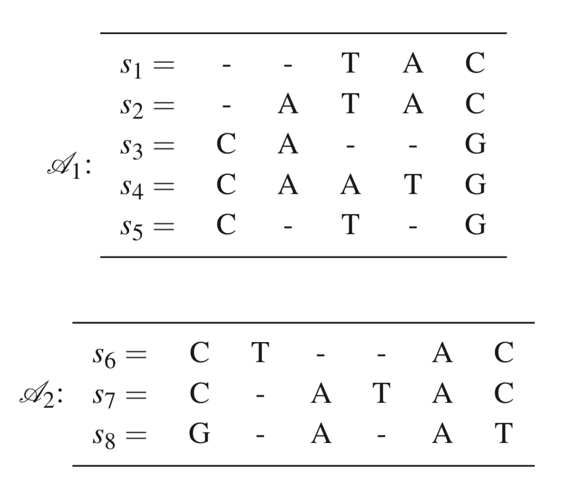
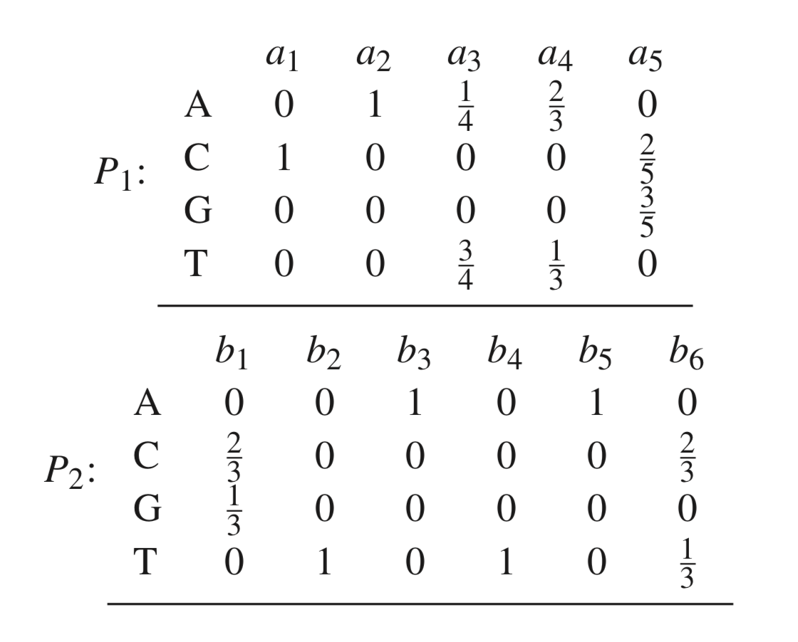
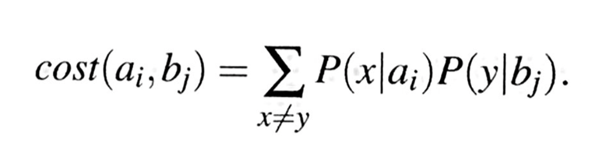
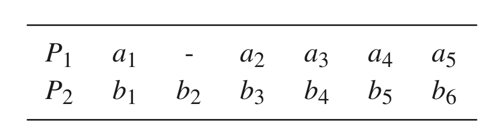
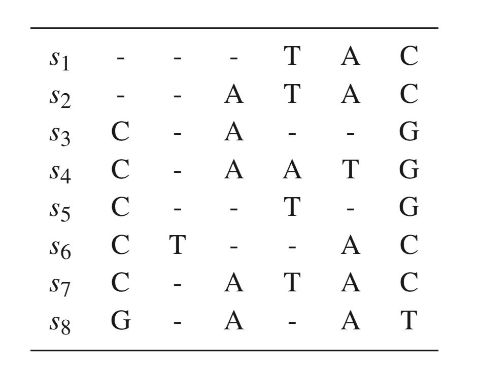

# Alignment methods (Part 2)

### Previous class check-up
- We reviewed the algorithms for pairwise and multiple sequence alignments (Needleman-Wunsch algorithm)

### Learning objectives

At the end of today's session, you
- will be able to explain the most widely used algorithms for multiple sequence alignment

{: .note }
No pre-class work.

## 3. Multiple sequence alignment

- The Needleman-Wunsch is the magic algorithm that allows us to align two sequences
- We want to expand the pairwise sequence alignment to multiple sequence alignment
- Progressive alignment: the most widely used algorithm (e.g. ClustalW)
- Consistency-based scoring: improvement over progressive alignment by using a more strict score function (e.g. T-Coffee)
- Iterative refinement algorithm: improvement over progressive alignment by doing sequential alignments until convergence of score (e.g. mafft, muscle)


## Progressive alignment

1. Compute rooted binary tree (guide tree) from pairwise distances
2. Build MSA from the bottom (leaves) up (root)


{: .highlight }
What is a rooted binary tree?


<div style="text-align:center"></div>

_Figure 9.9 in Warnow (2018) Computational phylogenetics_


### Progressive alignment algorithm

1. Align all pairs of sequences using the Needleman-Wunsch algorithm
2. For every pairwise alignment, we calculate its cost based on the cost of gap (e.g. unit cost) and the cost of substitution (e.g. unit cost)
3. We estimate the tree from distances: we will learn this in Lecture 8. Let's pretend we already have the tree
4. We build the alignments on the tree from the leaves to the root (bottom-up)  
  - For the leaves, we build the pairwise alignments for (a,b) and for (d,e) using the Needleman-Wunsch algorithm
  - For internal nodes, we need to know how to align alignments

### What are the ingredients that we need to know to perform MSA via progressive alignment?
- Perform pairwise sequence alignment via Needleman-Wunsch (check!)
- Calculate the cost of a pairwise sequence alignment (check!)
- Calculate a tree from distances (Lecture 8)
- Perform alignment of alignments (missing)


# How to align alignments

We need a new concept called "profile".

<div class="image123">
    
    
</div>


## Aligning alignments

1. Construct profiles
2. Define the cost of putting $a_i, b_j$ together. We want to minimize the expected cost between profiles
3. Use Needleman-Wunsch to align $P_1$ and $P_2$ based on the costs


### Aligning alignments: defining the costs

Treat $a_i$ in $P_1$ and $b_j$ in $P_2$ as probability models: $P(x \vert a_i)$ is the probability of observing nucleotide $x$ in position $i$ on the profile $P_1$ (Example: What is $P(A \vert a_1)$?)

<div class="image123">
    
    
</div>

We define the cost as

<div style="text-align:center"></div>

{: .highlight }
**In-class exercise:** What is the $cost(a_3,b_2)$?


# Homework

**Instructions:** Build the cost matrix for the two following profiles. This means that you want to calculate $cost(a_i,b_j)$ for all $i$ and $j$.

<div class="image123">
    
    
</div>


# Aligning the alignments: we have the cost matrix, now what?

Assume we got the following cost matrix

```  
     a1   a2  a3  a4   a5
b1 [ 1/3  1  1    1   8/15 ]  
b2 [  1   1  1/4  2/3  1   ]  
b3 [  1   0  3/4  1/3  1   ]
b4 [  1   1  1/4  2/3  1   ]
b5 [  1   0  3/4  1/3  1   ]
b6 [ 1/3  1  9/12 8/9 11/15]
```

and we will use it to align the two profiles $P_1 = a_1 a_2 a_3 a_4 a_5$ and $P_2 = b_1 b_2 b_3 b_4 b_5 b_6$ with Needleman-Wunsch. The cost matrix above provides the costs of substitutions and we assume a cost of gap of 1.

{: .note }
The video on canvas has two errors: $cost(a3,b1)=1/4$ instead of 1 and $cost(a4,b6)=7/9$ instead of 8/9.

{: .highlight }
**In-class activity:** Let's recall Needleman-Wunsch: we need the $F(i,j)$ matrix and then trace back the alignment. Let's do here together some of the entries of the $F(i,j)$ matrix.


# Homework

**Instructions:** Finish Needleman-Wunsch on the two profiles.

1. Build the F matrix
2. Trace back the alignment from the bottom right corner


**Solution:**
You should get the following alignment which we can translate back to the original sequences.

<div class="image123">
    
    
</div>


{: .important }
**MSA key insights** Needleman-Wunsch lies at the core of MSA: if we have two sequences, we align them with Needleman-Wunsch; if we have two alignments, we first convert them to profiles, and then align the profiles with Needleman-Wunsch. The final alignment will depend on the assumptions on the cost of substitutions and costs of gaps


{: .highlight }
**Homework recap** [here](https://github.com/crsl4/phylogenetics-class/blob/master/exercises/hw-needleman.md).

{: .highlight }
**For next class:** Read the paper corresponding to your group (in canvas): [ClustalW](https://www.ncbi.nlm.nih.gov/pmc/articles/PMC308517/), [MUSCLE](https://academic.oup.com/nar/article/32/5/1792/2380623), [T-Coffee](https://www.sciencedirect.com/science/article/pii/S0022283600940427)
