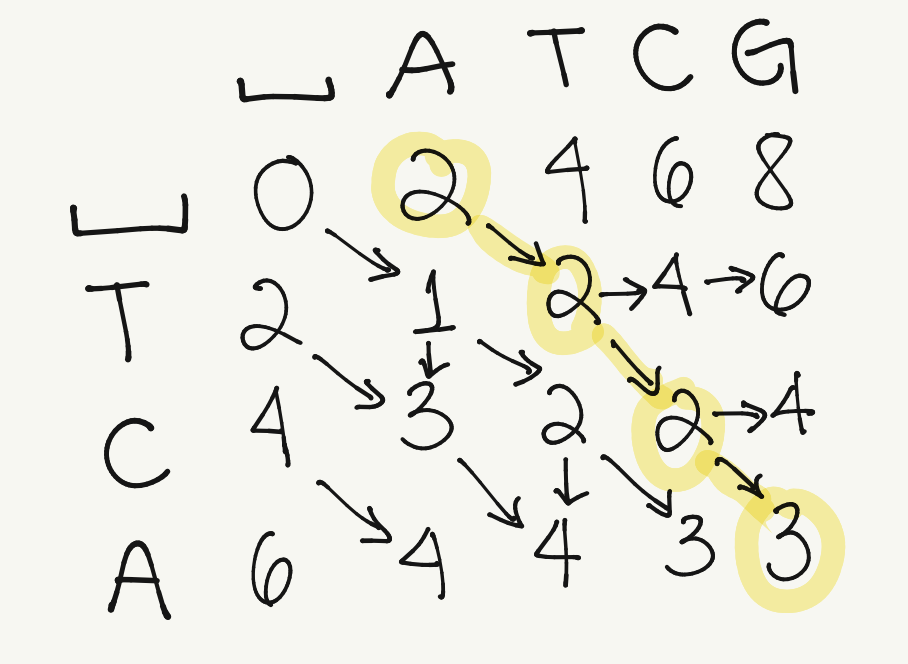

class: left, top

# Lecture 5

### Previous class check-up
- We understand sequencing technologies
- We learned a bit about `phyluce` as a pipeline for phylogenomics on UCEs and about `FastQC` for QC of raw reads

### Learning objectives

At the end of today's session, you
- will be able to explain the most widely used algorithms for multiple sequence alignment
- will be able to assess the strengths and weaknesses of each type of algorithm
- will learn to use different software options: ClustalW, T-Coffee and MUSCLE

### Pre-class work

- No pre-class work this time!

---
class: left, top

# What is multiple sequence alignment (MSA)?

- Homology is inferred from an input of sequences that are assumed to have an evolutionary relationship: descended from a common ancestor
- Intuitively, an MSA method inserts gap characters (`-`) inside input sequences to produce a set of longer sequences that are all of the same length, such that residues at the same position in different sequences (aligned residues) share some common properties (homology)
- MSA is a crucial step since phylogenetic inference methods assume that residue homology relationships are correctly reflected by the input sequences

---
class: left, top

# What is multiple sequence alignment (MSA)?

<div style="text-align:center"></div>

_Figure 9.1 in Warnow_

---
class: left, top

# What is multiple sequence alignment (MSA)?

The true MSA reflects the historical substitution, insertion and deletion evolutionary events:

<div style="text-align:center"></div>

_Figure 9.2 in Warnow_

---
class: left, top

# Why is it one of the most computationally intensive tasks?

- Alignment can be not identifiable or unique

#### Example 9.1
Suppose that we knew the _true_ evolutionary events from sequence `ACAT` to `AGAT`. Suppose that we knew that it was not a substitution, but a deletion of `C` (thus creating `AAT`) followed by an insersion of `G`. Even in this scenario (when we know the truth), there are two ways to represent the alignment:
```
AC-AT
A-GAT
```
and
```
A-CAT
AG-AT
```


---
class: left, top

## In-class activity

**Table 9.1** (Warnow). What would be the alignment of the sequence `S=ACATTA` which evolves into `S'=TACA` if we knew the _true_ evolutionary events?
- deletion of the first two nucleotides `AC`
- deletion of the second `T`
- substitution of `T` into `C`
- insersion of `T` at the front

---
class: left, top

## In-class activity

**Table 9.2** (Warnow). Without knowing the _true_ evolutionary events from `S` to `S'`, what would you think is a good alignment?

---
class: left, top

## In-class activity

**Table 9.2** (Warnow). Without knowing the _true_ evolutionary events from `S` to `S'`, what would you think is a good alignment?

**Solution:** You probably choose an alignment where none (or few) of the _true_ homology relationships are correct.
- The true alignment has 4 events: 2 deletions, 1 insersion, 1 substitution
- The estimated alignment we created now also has 4 events: 3 deletions and 1 insersion
- The algorithm will ultimately choose an alignment based on how we penalize each of the events

---
class: left, top

## First key insight for MSA

We are guiding the algorithms by selecting the penalties for evolutionary events: substitutions, deletions, insersions. It has nothing to do with _true_ evolutionary events or _true_ homology.

---
class: left, top

# MSA algorithm

**Input:** unaligned sequences (different lengths)

**Output:** aligned sequences (same length) where each site is an assertion of homology


Steps in MSA:
1. Define cost of each event: deletion, insertion, substitution
2. Learn to obtain the optimal pairwise alignment with the minimum cost ("edit distance")
3. Learn to obtain the optimal multiple sequence alignment: we need to be able to align alignments

---
class: left, top

# MSA algorithm
## 1. Cost of evolutionary events

- cost of deletion/insersion (cost of gap): 1
- cost of substitution: 1


**Note:** Some software/books will actually use "weights" instead of costs:
- weight for match: 5
- weight for gap: -1
- weight for mismatch (substitution): -1

I prefer to use costs because the idea of negative weights is not intuitive.


---
class: left, top

# MSA algorithm
## 1. Cost of evolutionary events
### In-class activity

**Table 9.3** (Warnow). How would you align the sequences `S=AACT` and `S'=CTGG` when:
- cost of gap: 1
- cost of substitution: 3
?


---
class: left, top

# MSA algorithm
## 1. Cost of evolutionary events
### In-class activity

**Table 9.3** (Warnow). How would you change the alignment between sequences `S=AACT` and `S'=CTGG` if the costs were: 
- cost of gap: 4
- cost of substitution: 1


---
class: left, top

# MSA algorithm
## 1. Cost of evolutionary events

There are other ways to measure cost/penalty:
- sequence identity: number of identical sites in an alignment divided by the total number of aligned positions
- biochemical similarity when assigning costs of substitutions (Figure 3.4 HB 3): PAM weight matrices and BLOSUM62 weight matrices

<div style="text-align:center"></div>


- We will continue to use cost for simplicity

---
class: left, top

# MSA algorithm
## 2. Pairwise sequence alignment

- Pairwise alignment of short toy sequences (like in the examples) can be done by hand
- Pairwise alignment of real sequences would be too difficult to do by hand, so we need smart algorithms: **Needleman-Wunsch algorithm**
- Needleman-Wunsch is a dynamic programming algorithm
- Dynamic programming: optimization algorithm that simplifies a complicated problem by breaking it down into simpler sub-problems in a recursive manner


---
class: left, top

# Needleman-Wunsch algorithm

- **Ingredients:** 
  - Two sequences: $A=a_1 a_2 ...a_m$ and $B=b_1 b_2 ...b_n$
  - 1) cost of gap and 2) cost of substitution
- Denote $F(i,j)$ the minimum cost to align sub-sequences $A_i$ and $B_j$ based on the costs
- **Main principle:** When we want to compute $F(i,j)$, we assume that we have already computed all smaller sequences (sub-problems): $F(i-1,j-1), F(i,j-1), F(i-1,j)$.

The final site of the alignment must take one of the following forms:

1. $a_i$ and $b_j$ are aligned together in the final site. Then the other sites define a pairwise alignment of $A_{i-1}$ and $B_{j-1}$
2. $a_i$ is aligned with a gap in the final site. Then $A_{i-1}$ and $B_{j}$ defined a pairwise alignment
3. $b_j$ is aligned with a gap in the final site. Then $A_{i}$ and $B_{j-1}$ defined a pairwise alignment

---
class: left, top

# Needleman-Wunsch algorithm

### Example of notation

Let $A=a_1 a_2 a_3 a_4 a_5 a_6$ and $B=b_1 b_2 b_3 b_4 b_5$, and suppose you want to align sites $a_5$ ( $i=5$ ) and $b_3$ ( $j=3$ )

1. $a_5$ and $b_3$ are aligned together in the final site. Then the other sites define a pairwise alignment of $A_4=a_1 a_2 a_3 a_4$ and $B_2=b_1 b_2$ (we do not know how at this point)
2. $a_5$ is aligned with a gap in the final site. Then $A_4=a_1 a_2 a_3 a_4$ and $B_3=b_1 b_2 b_3$ define a pairwise alignment
3. $b_3$ is aligned with a gap in the final site. Then $A_5=a_1 a_2 a_3 a_4 a_5$ and $B_2=b_1 b_2$ define a pairwise alignment

---
class: left, top

# Needleman-Wunsch algorithm: Costs

1. If $a_i$ and $b_j$ are aligned together in the final site, then the cost is 0 if $a_i=b_j$ and 1 (or whatever cost of substitution defined) if they are different. Hence, the total cost is $F(i,j) = F(i-1,j-1)+cost(a_i,b_j)$
2. If $a_i$ is aligned with a gap in the final site, then the cost is 1 (or whatever the cost of gap is). Hence, the the total cost is $F(i,j) = F(i-1,j)+1$
3. If $b_j$ is aligned with a gap in the final site, then the cost is 1 (or whatever the cost of gap is). Hence, the the total cost is $F(i,j) = F(i,j-1)+1$

How to know which of the three options to do? We choose the one with minimum cost!

$F(i,j)=min {F(i-1,j-1)+cost(a_i,b_j), F(i-1,j)+1, F(i,j-1)+1 }$.

---
class: left, top

# Needleman-Wunsch algorithm

Steps:
1. Compute $F(i,j)$ for every $i,j$ and put in a matrix (sometimes denoted dynamic programming (DP) matrix). First column/row correspond to gap and F(0,0)=0
2. As you fill the matrix, keep track of which of the three entries gave you the minimum with an arrow
3. Trace back the arrows to construct the alignment (diagonal arrow=nucleotide, vertical/horizontal arrow=gap replacing the nucleotide the arrow is pointing)

<div style="text-align:center"></div>

_Figure 9.3 from Warnow_

---
class: left, top

# Needleman-Wunsch algorithm

### Example

We want to align $S_1=ATCG$ and $S_2=TCA$ for a cost of substitution of 1 and cost of gap of 2.

---
class: left, top

# Needleman-Wunsch algorithm

### Example

We want to align $S_1=ATCG$ and $S_2=TCA$ for a cost of substitution of 1 and cost of gap of 2.

**Homework:** Complete at home the F matrix (details in next slide).

**How do we get the alignment after building the F matrix?** We trace back the arrows from the bottom right corner.

<div style="text-align:center"></div>


---
class: left, top

# Homework: Needleman-Wunsch algorithm

**Instructions:** Watch the class video on canvas with the rest of the steps of the Needleman-Wunsch algorithm and redo the same example with a cost of gap of 1 and a cost of substitions of 3 to compare the final alignment in both cases. 


**Important take-home message:** The final alignment depends on the costs of gaps and substitutions.


---
class: left, top

# MSA algorithm
## 3. Multiple sequence alignment

- The Needleman-Wunsch is the magic algorithm that allows us to align two sequences
- We want to expand the pairwise sequence alignment to multiple sequence alignment
- Progressive alignment: the most widely used algorithm (e.g. ClustalW)
- Consistency-based scoring: improvement over progressive alignment by using a more strict score function (e.g. T-Coffee)
- Iterative refinement algorithm: improvement over progressive alignment by doing sequential alignments until convergence of score (e.g. mafft, muscle)


### Progressive alignment

Steps:
1. Compute rooted binary tree (guide tree) from pairwise distances
2. Build MSA from the bottom (leaves) up (root)


---
class: left, top

# Wait a minute, what is a rooted binary tree?


---
class: left, top

# Progressive alignment

What are the steps that we need to know?

<div style="text-align:center"></div>

_Figure 9.9 in Warnow_


---
class: left, top

# Progressive alignment

1. Align all pairs of sequences using the Needleman-Wunsch algorithm
2. For every pairwise alignment, we calculate its cost based on the cost of gap (e.g. unit cost) and the cost of substitution (e.g. unit cost)
3. We estimate the tree from distances: we will learn this in Lecture 8. Let's pretend we already have the tree
4. We build the alignments on the tree from the leaves to the root (bottom-up)  
  - For the leaves, we build the pairwise alignments for (a,b) and for (d,e) using the Needleman-Wunsch algorithm
  - For internal nodes, we need to know how to align alignments

#### What are the ingredients that we need to know to perform MSA via progressive alignment?
- Perform pairwise sequence alignment via Needleman-Wunsch (check!)
- Calculate the cost of a pairwise sequence alignment (check!)
- Calculate a tree from distances (Lecture 8)
- Perform alignment of alignments (missing)


---
class: left, top

# How to align alignments

We need a new concept called "profile".

<div class="image123">
    
    
</div>


---
class: left, top

# How to align alignments

1. Construct profiles
2. Define the cost of putting $a_i, b_j$ together. We want to minimize the expected cost between profiles
3. Use Needleman-Wunsch to align $P_1$ and $P_2$ based on the costs


---
class: left, top

# How to align alignments: defining the costs

- Treat $a_i$ in $P_1$ and $b_j$ in $P_2$ as probability models: $P(x|a_i)$ is the probability of observing nucleotide $x$ in position $i$ on $P_1$ (Example: What is $P(A|a_1)$?)

<div class="image123">
    
    
</div>

- Define the cost as

<div style="text-align:center"></div>

- **In-class exercise:** What is the $cost(a_3,b_2)$?

---
class: left, top

# Homework

**Instructions:** Build the cost matrix for the two profiles:

<div class="image123">
    
    
</div>

---
class: left, top

# Aligning the alignments

Assume we got the following cost matrix

```  
     a1   a2  a3  a4   a5
b1 [ 1/3  1  1/4  1   8/15 ]  
b2 [  1   1  1/4  2/3  1   ]  
b3 [  1   0  3/4  1/3  1   ]
b4 [  1   1  1/4  2/3  1   ]
b5 [  1   0  3/4  1/3  1   ]
b6 [ 1/3  1  9/12 7/9 11/15]
```

and we will use it to align the two profiles $P_1 = a_1 a_2 a_3 a_4 a_5$ and $P_2 = b_1 b_2 b_3 b_4 b_5 b_6$ with Needleman-Wunsch. The cost matrix provides the costs of substitutions and we assume a cost of gap of 1.

**In-class activity:** Let's recall Needleman-Wunsch: we need the $F(i,j)$ matrix and then trace back the alignment. Let's do here together some of the entries of the $F(i,j)$ matrix.

---
class: left, top

# Homework

**Instructions:** Finish Needleman-Wunsch on the two profiles.

1. Build the F matrix
2. Trace back the alignment from the bottom right corner

---
class: left, top

# Homework solution:

You should get the following alignment which we can translate back to the original sequences.

<div class="image123">
    
    
</div>

---
class: left, top

# MSA key insights
- Needleman-Wunsch lies at the core of MSA:
  - if we have two sequences, we align them with Needleman-Wunsch
  - if we have two alignments, we first convert them to profiles, and then align the profiles with Needleman-Wunsch
- The final alignment will depend on the assumptions on the cost of substitutions and costs of gaps

---
class: left, top

---
class: left, top

# Progressive alignment

### Steps

1. Compute rooted binary tree (guide tree) from pairwise distances
2. Build MSA from the bottom (leaves) up (root)

<div style="text-align:center"></div>

_Figure 9.9 in Warnow_

---
class: left, top

# Progressive alignment

### Software: ClustalW

- input sequences -> progressive alignment
- pairwise alignment to create distance matrix and then tree based on NJ
- sequences are down-weighted compared to how closely related they are to other sequences (to avoid a group of similar sequences to dominate the alignment)
- different weight matrices are used: 1) for closely related sequences where high scores are given to identities and low scores ow; 2) for distantly related sequences where high scores are given to conservative amino acid matches and low score to identities (BLOSUM, PAM matrices)
- the program varies the gap penalties (GP) for sequences and positions
- most widely used option, but several methods have been shown more accurate and fast

[Thompson, 1994, ClustalW](https://www.ncbi.nlm.nih.gov/pmc/articles/PMC308517/)

---
class: left, top

# Progressive alignment

### Downsides

- The guide tree has a big impact on alignments (and we usually estimate an inaccurate tree). Some ways to overcome this issue are
    - better ways to estimate the tree (maximum likelihood); not very scalable
    - iteration between tree and alignment; not very scalable
- Errors made early in the process persist since subsequent mergers never change the alignments they are merging together. Some ways to overcome this issue are 
    - "polishing": breaks a set of sequences into subsets and re-aligns the induced sub-alignments
    - consistency


---
class: left, top

# Iterative refinement

<div style="text-align:center"></div>

[Edgar, 2004, MUSCLE](https://academic.oup.com/nar/article/32/5/1792/2380623)

---
class: left, top

# Iterative refinement

### Software: MUSCLE
- outperforms ClustalW in most settings but it is less scalable
- [MAFFT](https://mafft.cbrc.jp/alignment/software/algorithms/algorithms.html) also performs iterative refinement

---
class: left, top

# Consistency-based scoring
- consistency-based scoring: overcomes progressive alignment local-minimum problem
- uses "weighted sum of pairs" (WSP) objective function; we want to find the MSA that maximizes the score of the alignments (or minimizes the cost)
- Sum-of-pairs alignment
  - the cost of a given multiple sequence alignment is defined by summing the costs of its site of induced pairwise alignments
  - given input set S of sequences and the function for computing the cost of any pairwise alignment, find an alignment A on S such that the sum of the induced pairwise alignments is minimized

---
class: left, top

# Consistency-based scoring

### Software: T-coffee
- uses intermediate sequences to improve the quality of the pairwise alignment. For example, we are aligning sequences A and C and get a pairwise alignment A-C. We need incorportate an intermediate sequence B, and pairwise A-B and B-C to then obtain the pairwise alignment (A-C)^*
- generally more accurate than Clustalw; but not scalable to large alignments

[Notredame, 2000, T-Coffee](https://www.sciencedirect.com/science/article/pii/S0022283600940427)

---
class: left, top

# Other algorithms

### Genetic algorithm
- SAGA uses the WSP objective function but uses genetic algorithms instead of dynamic programming (individual=alignment)
- very accurate
- more scalable than t-coffee, but still not super scalable

### Hidden markov model
- [UPP](https://genomebiology.biomedcentral.com/articles/10.1186/s13059-015-0688-z)
- [pasta](https://www.ncbi.nlm.nih.gov/pmc/articles/PMC4424971/)

### Simultaneous estimation tree/alignment
- [sate](https://phylo.bio.ku.edu/software/sate/sate.html)


---
class: left, top

## Which program to choose?
- not a clear answer
- scalability vs accuracy
- journal club discussion: [Alignathon](https://genome.cshlp.org/content/24/12/2077)
- filtering is more important than the specific program used (more on filtering later)

## Other considerations

- Nucleotide vs amino acid sequence
  - when there is choice (protein-coding genes), amino acid alignments are easier to carry out and less ambiguous; also nucleotide alignments do not recognizoe codon as a unit and can break up the reading frame; typically, you align the amino acids and then generate the corresponding nucleotide sequence alignment
  - when sequences are not protein coding, only choice is to align nucleotides

- Manual editing and visualizing alignments
  - manual editing is scary because it is not reproducible
  - but many times it is necessary because automatic alignment methods are not as accurate as they should be


---
class: left, top

# Software options

## ClustalW

- [ClustalW](http://www.clustal.org/clustal2/)
- From the [docs](http://www.clustal.org/download/clustalw_help.txt):

```
DATA (sequences)

-INFILE=file.ext                             :input sequences.
-PROFILE1=file.ext  and  -PROFILE2=file.ext  :profiles (old alignment).


                VERBS (do things)

-OPTIONS            :list the command line parameters
-HELP  or -CHECK    :outline the command line params.
-FULLHELP           :output full help content.
-ALIGN              :do full multiple alignment.
-TREE               :calculate NJ tree.
-PIM                :output percent identity matrix (while calculating the tree)
-BOOTSTRAP(=n)      :bootstrap a NJ tree (n= number of bootstraps; def. = 1000).
-CONVERT            :output the input sequences in a different file format.
```

---
class: left, top

## ClustalW

```
                PARAMETERS (set things)

***General settings:****
-INTERACTIVE :read command line, then enter normal interactive menus
-QUICKTREE   :use FAST algorithm for the alignment guide tree
-TYPE=       :PROTEIN or DNA sequences
-NEGATIVE    :protein alignment with negative values in matrix
-OUTFILE=    :sequence alignment file name
-OUTPUT=     :GCG, GDE, PHYLIP, PIR or NEXUS
-OUTORDER=   :INPUT or ALIGNED
-CASE        :LOWER or UPPER (for GDE output only)
-SEQNOS=     :OFF or ON (for Clustal output only)
-SEQNO_RANGE=:OFF or ON (NEW: for all output formats)
-RANGE=m,n   :sequence range to write starting m to m+n
-MAXSEQLEN=n :maximum allowed input sequence length
-QUIET       :Reduce console output to minimum
-STATS=      :Log some alignents statistics to file
```

---
class: left, top

## ClustalW

```
***Multiple Alignments:***
-NEWTREE=      :file for new guide tree
-USETREE=      :file for old guide tree
-MATRIX=       :Protein weight matrix=BLOSUM, PAM, GONNET, ID or filename
-DNAMATRIX=    :DNA weight matrix=IUB, CLUSTALW or filename
-GAPOPEN=f     :gap opening penalty        
-GAPEXT=f      :gap extension penalty
-ENDGAPS       :no end gap separation pen. 
-GAPDIST=n     :gap separation pen. range
-NOPGAP        :residue-specific gaps off  
-NOHGAP        :hydrophilic gaps off
-HGAPRESIDUES= :list hydrophilic res.    
-MAXDIV=n      :% ident. for delay
-TYPE=         :PROTEIN or DNA
-TRANSWEIGHT=f :transitions weighting
-ITERATION=    :NONE or TREE or ALIGNMENT
-NUMITER=n     :maximum number of iterations to perform
-NOWEIGHTS     :disable sequence weighting
```

---
class: left, top

## ClustalW

What are the default values?

Another thing to notice:

```
==ITERATION==

 A remove first iteration scheme has been added. This can be used to improve the final
 alignment or improve the alignment at each stage of the progressive alignment. During the 
 iteration step each sequence is removed in turn and realigned. If the resulting alignment 
 is better than the  previous alignment it is kept. This process is repeated until the score
 converges (the  score is not improved) or until the maximum number of iterations is 
 reached. The user can  iterate at each step of the progressive alignment by setting the 
 iteration parameter to  TREE or just on the final alignment by seting the iteration 
 parameter to ALIGNMENT. The default is no iteration. The maximum number of  iterations can 
 be set using the numiter parameter. The default number of iterations is 3.
  
 -ITERATION=    :NONE or TREE or ALIGNMENT
 
 -NUMITER=n     :Maximum number of iterations to perform
```

**Further reading:** Read the ClustalW [documentation](http://www.clustal.org/download/clustalw_help.txt). Is it clear what the algorithm is doing and how to best select the parameters involved? What is missing (if any) from this documentation?

---
class: left, top

## T-Coffee

- [T-Coffee](http://www.tcoffee.org/Projects/tcoffee/documentation/index.html#quick-start-t-coffee)

```shell
$ t_coffee sample_seq1.fasta
```

- When aligning, T-Coffee will always at least generate three files:
  - `sample_seq1.aln` : Multiple Sequence Alignment (ClustalW format by default)
  - `sample_seq1.dnd` : guide tree (Newick format)
  - `sample_seq1.html` : colored MSA according to consistency (html format)
- `T-Coffee` also has a great [documentation](http://www.tcoffee.org/Projects/tcoffee/documentation/index.html#document-tcoffee_main_documentation)
- Specifically, it has a good description of the parameters, see [here](http://www.tcoffee.org/Projects/tcoffee/documentation/index.html#t-coffee-parameters-flags)
- Don't forget to check out [M-Coffee](http://www.tcoffee.org/Projects/tcoffee/documentation/index.html#m-coffee) that combines the output of eight aligners (MUSCLE, ProbCons, POA, DIALIGN-T, MAFFT, ClustalW, PCMA and T-Coffee)

---
class: left, top

## MUSCLE

- [MUSCLE](https://www.drive5.com/muscle/)
- The different parameter options are explained [here](https://www.drive5.com/muscle/manual/options.html)
- The default settings are chosen for maximum accuracy, but you can change the settings for more speed (see [here](https://www.drive5.com/muscle/manual/index.html))


---
class: left, top

# Homework 1 

### ClustalW
1. Download [ClustalW](http://www.clustal.org/clustal2/)
2. Download the `primatesAA.fasta` file from the Phylogenetic Handbook [website](https://www.kuleuven.be/aidslab/phylogenybook/Data_sets.html) (22 primate aminoacid sequences)
3. Run `ClustalW`, see [docs](http://www.clustal.org/download/clustalw_help.txt)

### T-Coffee
1. Download [T-Coffee](http://www.tcoffee.org/Projects/tcoffee/index.html#DOWNLOAD)
2. Run `T-Coffee` on the same `primatesAA.fasta` data. See the [docs](http://www.tcoffee.org/Projects/tcoffee/documentation/index.html#quick-start-t-coffee)

### MUSCLE
1. Download [MUSCLE](https://www.drive5.com/muscle/downloads.htm)
2. Run `MUSCLE` on the same `primatesAA.fasta` data. See the [docs](https://www.drive5.com/muscle/manual/basic_alignment.html)


You can use my reproducible script as guideline: [notebook-log.md](https://github.com/crsl4/phylogenetics-class/tree/master/exercises/notebook-log.md)

---
class: left, top

# Homework 2

**Instructions:**

- Choose the alignment method that you like the best (or try different options) on your class dataset
- Make sure to keep notes in your reproducible script and keep the most updated version on github (it is important to push your work to github since this allows me to check what you are doing and offer suggestions)

---
class: left, top

# Filtering alignments
(HAL 2.2)

- MSA is messy and error-prone, so many times we need to filter out poorly aligned regions
- We need to make sure that we do not remove signal along with the noise
- The balance depends on the planned downstream analysis: 
  - Example: misaligned regions impacting a single seauence at one time will have little impact on the phylogeny inference apart from terminal branch length estimations, but they will induce many false positives when searching for loci under positive selection
- We want automatic MSA cleaning methods, not manual for reproducibility reasons, but there are no options yet
- Two types of filtering methods:
    - (take it or leave it) TILI-filtering methods: remove whole sites or whole sequences
    - masking residues: replace by gap or a symbol representing ambiguity ?,N,X

---
class: left, top

### What are the problematic regions of an aligment?

<div style="text-align:center"></div>

---
class: left, top

### What are the problematic regions of an aligment?

1. poorly informative
  - patchy: too many gaps (Fig 8a HAL)
  - regions in the vicinity of patchy regions (Fig 8b HAL)

2. wrongly aligned
  - misaligned regions (Fig 8c HAL)
  - low complexity regions with repeated characteristics (Fig 8d HAL)

---
class: left, top

### What causes problematic MSA regions?
- Highly divergent or non-homologous sequence fragments
    - Note that even when sequences are too divergent, or not even homologous, MSA software will still produce an alignment
    - Somewhere along the gradient from highly similar sequences to highly divergent sequences,
there is a critical point beyond which to align sequences is not possible, or biologically
meaningful: too many substitutions or indels have occurred

- High-throughput sequencing or annotation errors 
    - Sequencing errors -> small indels in nucleotide alignments -> errors in translation
    - Errors in homology annotation can lead to the inclusion of sequences that are not homologous
    - This more tricky case occurs
when all considered sequences are homologous but some are erroneously considered as being
orthologous (derived from ancestral copy by speciation) while actually being paralogous
(derived from ancestral copy by duplication)

---
class: left, top

### Principles underlying filtering methods

- Gaps indicate hard to align and possibly saturated regions 
    - From a biological viewpoint, it is often assumed that in proteins insertions and deletions are less frequent than point substitutions

- Few/similar residues are expected per site
- Reliable regions are likely more robust to MSA method variations

- Homologous (fragment of) sequences are expected to be similar (pre-filtering)
    - For most pipelines, sequence similarity is an initial criterion used to identify homologous sequences

- Orthologous sequences are supposed to be congruent over loci
(post-filtering)

---
class: left, top

### TILI-filtering methods vs masking residues methods


- they are fated to remove signals along with noise
- TILI-filtering methods could still do a great job regarding phylogeny inference if they are able to correctly identify and remove sequences and sites containing more noise than signal
- In general, masking residues methods are better

---
class: left, top

## Comparison of filtering methods

<div style="text-align:center"></div>

---
class: left, top

## Comparison of filtering methods

<div style="text-align:center"></div>

- [OMM_MACSE pipeline](https://github.com/ranwez/MACSE_V2_PIPELINES) and [HmmCleaner](https://metacpan.org/pod/distribution/Bio-MUST-Apps-HmmCleaner/bin/HmmCleaner.pl) among the best filtering methods, but careful since not simulated data

---
class: left, top

# Further reading

Learn more
- Read Chapter 3 of the Phylogenetic Handbook (HB)
- Read Sections 9.1-9.5, 9.11, 9.12, 9.13 of [Computational phylogenetics](https://www.amazon.com/Computational-Phylogenetics-Introduction-Designing-Estimation/dp/1107184711) (Warnow) 
- Read HAL 2.3 on a new alignment method `MACSE`