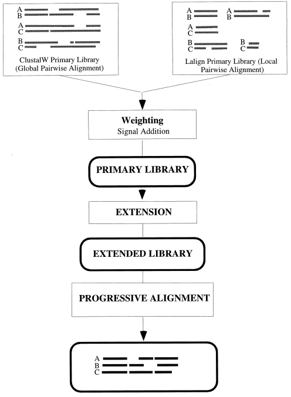

class: left, top

# Lecture 5

### Previous class check-up
- We reviewed the algorithms for pairwise and multiple sequence alignments

### Learning objectives

At the end of today's session, you
- will be able to explain the most widely used algorithms for multiple sequence alignment
- will be able to assess the strengths and weaknesses of each type of algorithm
- will learn to use different software options: ClustalW, T-Coffee and MUSCLE

### Pre-class work

- Read the paper corresponding to your group:
  - [ClustalW](https://www.ncbi.nlm.nih.gov/pmc/articles/PMC308517/)
  - [MUSCLE](https://academic.oup.com/nar/article/32/5/1792/2380623)
  - [T-Coffee](https://www.sciencedirect.com/science/article/pii/S0022283600940427)


---
class: left, top

# MSA key insights
- Needleman-Wunsch lies at the core of MSA:
  - if we have two sequences, we align them with Needleman-Wunsch
  - if we have two alignments, we first convert them to profiles, and then align the profiles with Needleman-Wunsch
- The final alignment will depend on the assumptions on the cost of substitutions and costs of gaps

---
class: left, top

# Progressive alignment: ClustalW

1. Compute rooted binary tree (guide tree) from pairwise distances
2. Build MSA from the bottom (leaves) up (root)

<div style="text-align:center"></div>

_Figure 9.9 in Warnow_

[Thompson, 1994, ClustalW](https://www.ncbi.nlm.nih.gov/pmc/articles/PMC308517/)

---
class: left, top

# Iterative refinement: MUSCLE

<div style="text-align:center"></div>

[Edgar, 2004, MUSCLE](https://academic.oup.com/nar/article/32/5/1792/2380623)

---
class: left, top

# Consistency-based scoring: T-Coffee

<div style="text-align:center"></div>

[Notredame, 2000, T-Coffee](https://www.sciencedirect.com/science/article/pii/S0022283600940427)

---
class: left, top

# In-class discussion

**Objective:** Understand the main algorithms, assumptions and limitations of three widely used MSA software.

**Instructions:**

1. Separate group discussions (20 minutes): Students will discuss with their respective groups and prepare a 10-minute presentation for the whole class. Use these google slides:
  - [ClustalW](https://docs.google.com/presentation/d/1vtegUr8V5Q3Cf-L9Q_RQKyeml1AVPejaHnNhIi5cNOA/edit?usp=sharing)
  - [MUSCLE](https://docs.google.com/presentation/d/1u9JyRZ-xwta4iCY0Dk4ZiyYzjOU02xMHqoON7HYP4Lg/edit?usp=sharing)
  - [T-Coffee](https://docs.google.com/presentation/d/1tFc-VL_lH3FEBXHdR8RQ7OB5imfiWIx-oyBWPS4Aaf0/edit?usp=sharing)

2. Group presentations (30 minutes total; 10 minutes per group): Each group will summarize their discussion in a 10-minute presentation to the class.

---
class: left, top

# MSA software key insights

- No perfect method
- No automatic method
  - All methods require manual work of comparing results from different alignment parameters and from different sofware
- Take notes of the choices you made and keep track of all comparisons to justify final choice
- We probably don't spend as much time as we should on the alignment step of the phylogenomic pipeline
  - We want a blackbox that does not exist yet!

---
class: left, top

# More detailed insights

### Progressive alignment: [Thompson, 1994, ClustalW](https://www.ncbi.nlm.nih.gov/pmc/articles/PMC308517/)

- pairwise alignment to create distance matrix and then tree based on NJ
- sequences are down-weighted compared to how closely related they are to other sequences (to avoid a group of similar sequences to dominate the alignment)
- different weight matrices are used: 1) for closely related sequences where high scores are given to identities and low scores ow; 2) for distantly related sequences where high scores are given to conservative amino acid matches and low score to identities (BLOSUM, PAM matrices)
- the program varies the gap penalties (GP) for sequences and positions
- most widely used option, but several methods have been shown more accurate and fast
- Downsides
  - The guide tree has a big impact on alignments (and we usually estimate an inaccurate tree). Some ways to overcome this issue are
      - better ways to estimate the tree (maximum likelihood); not very scalable
      - iteration between tree and alignment; not very scalable
  - Errors made early in the process persist since subsequent mergers never change the alignments they are merging together


---
class: left, top

### Iterative refinement: [Edgar, 2004, MUSCLE](https://academic.oup.com/nar/article/32/5/1792/2380623)

- outperforms ClustalW in most settings but it is less scalable
- [MAFFT](https://mafft.cbrc.jp/alignment/software/algorithms/algorithms.html) also performs iterative refinement


### Consistency-based scoring: [Notredame, 2000, T-Coffee](https://www.sciencedirect.com/science/article/pii/S0022283600940427)
- consistency-based scoring: overcomes progressive alignment local-minimum problem
- uses "weighted sum of pairs" (WSP) objective function; we want to find the MSA that maximizes the score of the alignments (or minimizes the cost)
- Sum-of-pairs alignment
  - the cost of a given multiple sequence alignment is defined by summing the costs of its site of induced pairwise alignments
  - given input set S of sequences and the function for computing the cost of any pairwise alignment, find an alignment A on S such that the sum of the induced pairwise alignments is minimized
- uses intermediate sequences to improve the quality of the pairwise alignment. For example, we are aligning sequences A and C and get a pairwise alignment A-C. We need incorportate an intermediate sequence B, and pairwise A-B and B-C to then obtain the pairwise alignment (A-C)
- generally more accurate than Clustalw; but not scalable to large alignments

---
class: left, top

## Other algorithms

### Genetic algorithm
- SAGA uses the WSP objective function but uses genetic algorithms instead of dynamic programming (individual=alignment)
- very accurate
- more scalable than T-coffee, but still not super scalable

### Hidden markov model
- [UPP](https://genomebiology.biomedcentral.com/articles/10.1186/s13059-015-0688-z)
- [pasta](https://www.ncbi.nlm.nih.gov/pmc/articles/PMC4424971/)

### Simultaneous estimation tree/alignment
- [sate](https://phylo.bio.ku.edu/software/sate/sate.html)

---
class: left, top

### Other considerations

- Nucleotide vs amino acid sequence
  - when there is choice (protein-coding genes), amino acid alignments are easier to carry out and less ambiguous; also nucleotide alignments do not recognize codon as a unit and can break up the reading frame; typically, you align the amino acids and then generate the corresponding nucleotide sequence alignment
  - when sequences are not protein coding, only choice is to align nucleotides
- Manual editing and visualizing alignments
  - manual editing is scary because it is not reproducible
  - but many times it is necessary because automatic alignment methods are not as accurate as they should be


### Which program to choose?
- not a clear answer
- scalability vs accuracy
- HW reading: [Alignathon](https://genome.cshlp.org/content/24/12/2077)
- **Strategy:**
  - Run multiple programs and parameter choices
  - Filtering is more important than the specific program used (more on filtering later)
  - Read program papers and documentation carefully!
  - Take good note of choices and keep track of all comparisons to justify final choice


---
class: left, top

# Software overview

## ClustalW

- [ClustalW](http://www.clustal.org/clustal2/)
- From the [docs](http://www.clustal.org/download/clustalw_help.txt):

```
DATA (sequences)

-INFILE=file.ext                             :input sequences.
-PROFILE1=file.ext  and  -PROFILE2=file.ext  :profiles (old alignment).


                VERBS (do things)

-OPTIONS            :list the command line parameters
-HELP  or -CHECK    :outline the command line params.
-FULLHELP           :output full help content.
-ALIGN              :do full multiple alignment.
-TREE               :calculate NJ tree.
-PIM                :output percent identity matrix (while calculating the tree)
-BOOTSTRAP(=n)      :bootstrap a NJ tree (n= number of bootstraps; def. = 1000).
-CONVERT            :output the input sequences in a different file format.
```

---
class: left, top

## ClustalW

```
                PARAMETERS (set things)

***General settings:****
-INTERACTIVE :read command line, then enter normal interactive menus
-QUICKTREE   :use FAST algorithm for the alignment guide tree
-TYPE=       :PROTEIN or DNA sequences
-NEGATIVE    :protein alignment with negative values in matrix
-OUTFILE=    :sequence alignment file name
-OUTPUT=     :GCG, GDE, PHYLIP, PIR or NEXUS
-OUTORDER=   :INPUT or ALIGNED
-CASE        :LOWER or UPPER (for GDE output only)
-SEQNOS=     :OFF or ON (for Clustal output only)
-SEQNO_RANGE=:OFF or ON (NEW: for all output formats)
-RANGE=m,n   :sequence range to write starting m to m+n
-MAXSEQLEN=n :maximum allowed input sequence length
-QUIET       :Reduce console output to minimum
-STATS=      :Log some alignents statistics to file
```

---
class: left, top

## ClustalW

```
***Multiple Alignments:***
-NEWTREE=      :file for new guide tree
-USETREE=      :file for old guide tree
-MATRIX=       :Protein weight matrix=BLOSUM, PAM, GONNET, ID or filename
-DNAMATRIX=    :DNA weight matrix=IUB, CLUSTALW or filename
-GAPOPEN=f     :gap opening penalty        
-GAPEXT=f      :gap extension penalty
-ENDGAPS       :no end gap separation pen. 
-GAPDIST=n     :gap separation pen. range
-NOPGAP        :residue-specific gaps off  
-NOHGAP        :hydrophilic gaps off
-HGAPRESIDUES= :list hydrophilic res.    
-MAXDIV=n      :% ident. for delay
-TYPE=         :PROTEIN or DNA
-TRANSWEIGHT=f :transitions weighting
-ITERATION=    :NONE or TREE or ALIGNMENT
-NUMITER=n     :maximum number of iterations to perform
-NOWEIGHTS     :disable sequence weighting
```

---
class: left, top

## ClustalW

What are the default values?

Another thing to notice:

```
==ITERATION==

 A remove first iteration scheme has been added. This can be used to improve the final
 alignment or improve the alignment at each stage of the progressive alignment. During the 
 iteration step each sequence is removed in turn and realigned. If the resulting alignment 
 is better than the  previous alignment it is kept. This process is repeated until the score
 converges (the  score is not improved) or until the maximum number of iterations is 
 reached. The user can  iterate at each step of the progressive alignment by setting the 
 iteration parameter to  TREE or just on the final alignment by seting the iteration 
 parameter to ALIGNMENT. The default is no iteration. The maximum number of  iterations can 
 be set using the numiter parameter. The default number of iterations is 3.
  
 -ITERATION=    :NONE or TREE or ALIGNMENT
 
 -NUMITER=n     :Maximum number of iterations to perform
```

**Further reading:** Read the ClustalW [documentation](http://www.clustal.org/download/clustalw_help.txt). Is it clear what the algorithm is doing and how to best select the parameters involved? What is missing (if any) from this documentation?

---
class: left, top

## T-Coffee

- [T-Coffee](http://www.tcoffee.org/Projects/tcoffee/documentation/index.html#quick-start-t-coffee)

```shell
$ t_coffee sample_seq1.fasta
```

- When aligning, T-Coffee will always at least generate three files:
  - `sample_seq1.aln` : Multiple Sequence Alignment (ClustalW format by default)
  - `sample_seq1.dnd` : guide tree (Newick format)
  - `sample_seq1.html` : colored MSA according to consistency (html format)
- `T-Coffee` also has a great [documentation](http://www.tcoffee.org/Projects/tcoffee/documentation/index.html#document-tcoffee_main_documentation)
- Specifically, it has a good description of the parameters, see [here](http://www.tcoffee.org/Projects/tcoffee/documentation/index.html#t-coffee-parameters-flags)
- Don't forget to check out [M-Coffee](http://www.tcoffee.org/Projects/tcoffee/documentation/index.html#m-coffee) that combines the output of eight aligners (MUSCLE, ProbCons, POA, DIALIGN-T, MAFFT, ClustalW, PCMA and T-Coffee)

---
class: left, top

## MUSCLE

- [MUSCLE](https://www.drive5.com/muscle/)
- The different parameter options are explained [here](https://www.drive5.com/muscle/manual/options.html)
- The default settings are chosen for maximum accuracy (how?), but you can change the settings for more speed (see [here](https://www.drive5.com/muscle/manual/index.html))


---
class: left, top

### In-class exercise (or homework)

**Instructions:** Run and compare the results of all three MSA software on a toy dataset of primates. You can use my reproducible script as guideline: [notebook-log.md](https://github.com/crsl4/phylogenetics-class/tree/master/exercises/notebook-log.md).

**ClustalW**

1. Download [ClustalW](http://www.clustal.org/clustal2/)
2. Download the `primatesAA.fasta` file from the Phylogenetic Handbook [website](https://www.kuleuven.be/aidslab/phylogenybook/Data_sets.html) (22 primate aminoacid sequences)
3. Run `ClustalW`, see [docs](http://www.clustal.org/download/clustalw_help.txt)

**T-Coffee**

1. Download [T-Coffee](http://www.tcoffee.org/Projects/tcoffee/index.html#DOWNLOAD)
2. Run `T-Coffee` on the same `primatesAA.fasta` data. See the [docs](http://www.tcoffee.org/Projects/tcoffee/documentation/index.html#quick-start-t-coffee)

**MUSCLE**

1. Download [MUSCLE](https://www.drive5.com/muscle/downloads.htm)
2. Run `MUSCLE` on the same `primatesAA.fasta` data. See the [docs](https://www.drive5.com/muscle/manual/basic_alignment.html)


---
class: left, top

# Homework

**Instructions:**

1. Read the [Alignathon](https://genome.cshlp.org/content/24/12/2077) paper for more information on how to select a MSA method
2. Choose the alignment method that you like the best on your project dataset
  - Note: for this HW, you only need to run one MSA method, but for your final project, you are expected to run at least two to compare the results
3. Make sure to keep notes in your reproducible script and keep the most updated version on github (it is important to push your work to github since this allows me to check what you are doing and offer suggestions)
4. Submit the link to your github commit in canvas

**Deadline:** March 2nd, 2022

---
class: left, top

# Further reading

Learn more:
- Read Chapter 3 of the Phylogenetic Handbook (HB)
- Read Sections 9.1-9.5, 9.11, 9.12, 9.13 of [Computational phylogenetics](https://www.amazon.com/Computational-Phylogenetics-Introduction-Designing-Estimation/dp/1107184711) (Warnow) 
- Read HAL 2.3 on a new alignment method `MACSE`