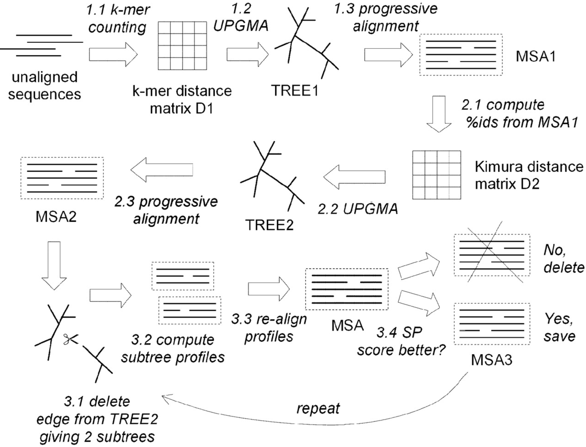
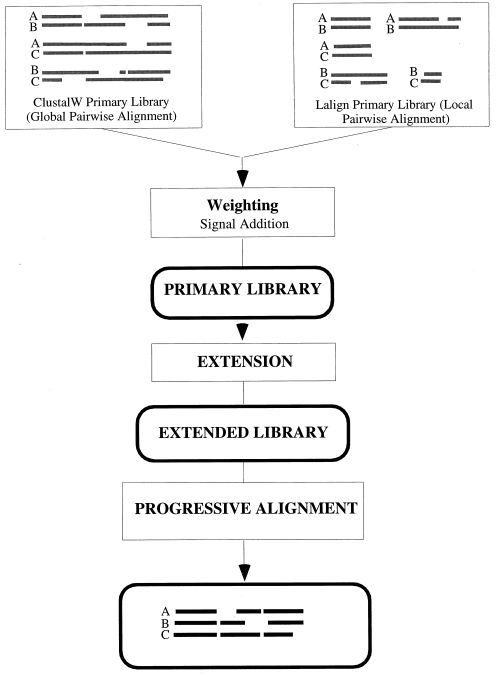

# Alignment methods (Part 3: paper discussion)

### Previous class check-up
- We studied the algorithms for multiple sequence alignment: Needleman-Wunsch, progresive alignment and improvements

### Learning objectives

At the end of today's session, you will be able to
- highlight the main differences among MSA methods

### Pre-class work

- Read the paper corresponding to your group (in canvas):
  - [ClustalW](https://www.ncbi.nlm.nih.gov/pmc/articles/PMC308517/)
  - [MUSCLE](https://academic.oup.com/nar/article/32/5/1792/2380623)
  - [T-Coffee](https://www.sciencedirect.com/science/article/pii/S0022283600940427)

# Project checklist: heavy HW on your data starting now

- Until now:
  - Created your project github repo
  - Added the link to the `class-repos.md` via pull request
  - Added me as collaborator on your github repo
  - Data chosen and added 1 slide about it to the shared google slides (link in canvas)
      - Don't wait on your data: you can use public data because you will be creating scripts to use later on the "real" data
  - Added a description about your data in your `notebook-log.md` (or similar reproducible script) in your github repo and pushed
  - QC on your data if needed: not perfect/complete, but at least a plan pushed to your github repo
- Next item: 
  - Alignment work pushed to your github repo

### Expectations as we move forward to heavy HW on your data
- You will be working on your data at home:
  - Troubleshooting with different data formats
  - Troubleshooting with software installation for your operating system
- Actively ask questions!
  - Slack
  - Office hours

# Alignment software: ClustalW, MUSCLE, T-Coffee

## Progressive alignment: ClustalW

1. Compute rooted binary tree (guide tree) from pairwise distances
2. Build MSA from the bottom (leaves) up (root)

_Figure 9.9 in Warnow (2018) Computational phylogenetics_

[Thompson, 1994, ClustalW](https://www.ncbi.nlm.nih.gov/pmc/articles/PMC308517/)

## Iterative refinement: MUSCLE

[Edgar, 2004, MUSCLE](https://academic.oup.com/nar/article/32/5/1792/2380623)

## Consistency-based scoring: T-Coffee

[Notredame, 2000, T-Coffee](https://www.sciencedirect.com/science/article/pii/S0022283600940427)

# In-class paper discussion

**Objective:** Understand the main algorithms, assumptions and limitations of three widely used MSA software.

**Instructions:**

1. Separate group discussions (25 minutes): Students will discuss with their respective groups and prepare a 10-minute presentation for the whole class. Use these google slides:
  - [ClustalW](https://docs.google.com/presentation/d/1eEstaSwu54rkQERawbAFIdZk9DFL31axmTo0lGmunOs/edit?usp=drive_link)
  - [MUSCLE](https://docs.google.com/presentation/d/1UWCriupXTdaP0pP3MC77N3Zv92k-JmHZ31wjO-zCGXc/edit?usp=drive_link)
  - [T-Coffee](https://docs.google.com/presentation/d/1Xr2HAaxCLTX_VWFXWhfyOksjM3moG0rD7D3lQ-_rl7Q/edit?usp=drive_link)

2. Group presentations (30 minutes total; 10 minutes per group): Each group will summarize their discussion in a 10-minute presentation to the class.

3. Class summary of the three software (10 minutes)

