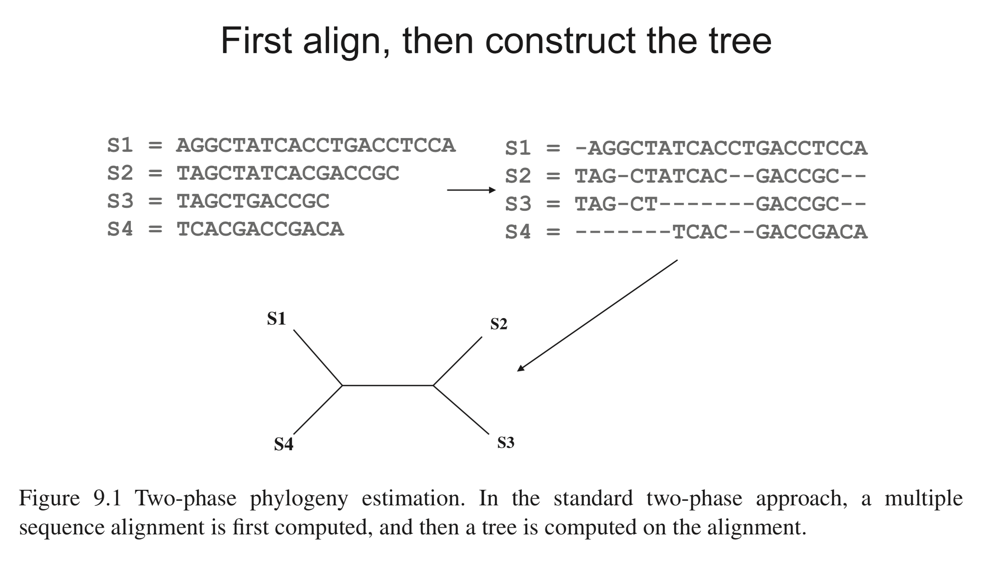
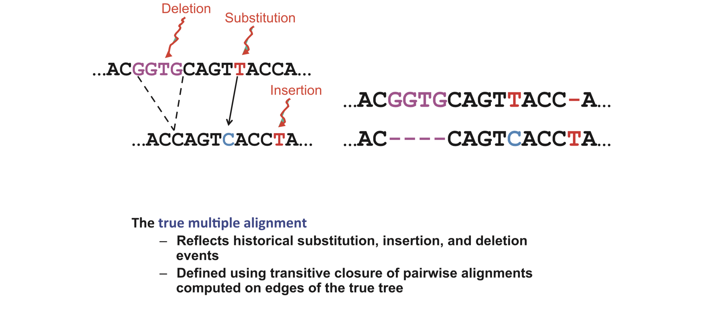
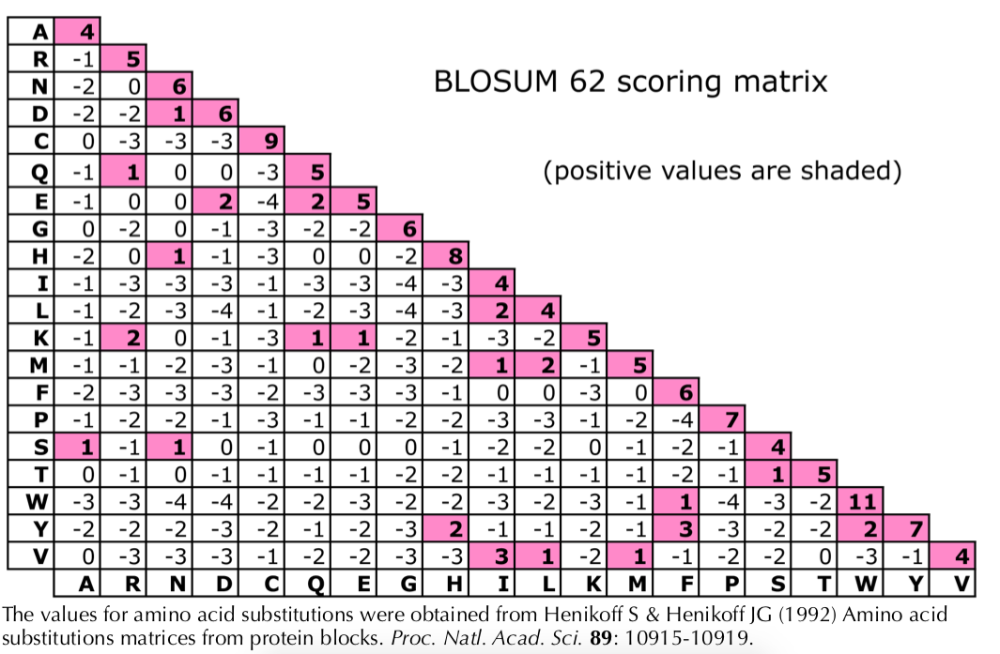
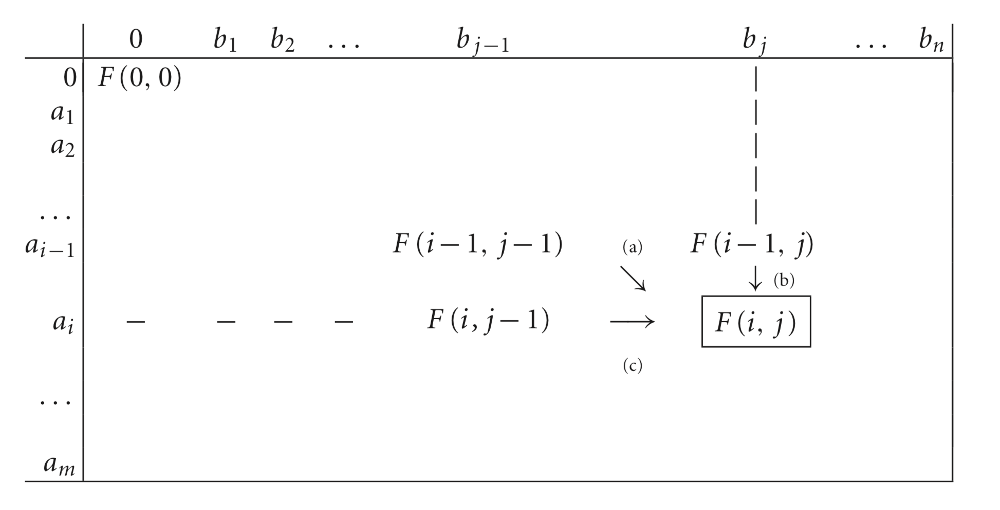
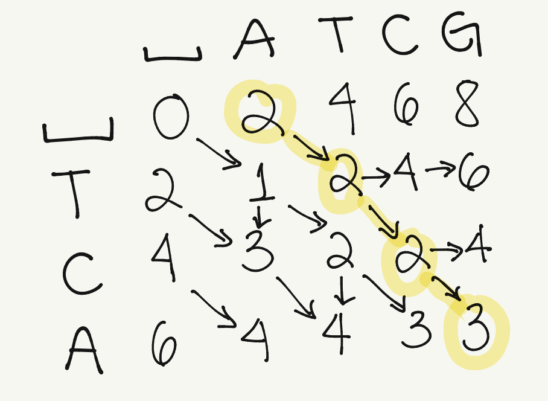

# Alignment methods (Part 1)

### Previous class check-up
- We are familiar with git/github
  - The class notes are in its own repo: 
      - `git clone` to download
      - `git pull` to update them, or 
      - fork and `git pull upstream master`
- We understand the importance of reproducible scripts
    - We created a github repo for the class project (remember to add me as collaborator to your repo)

### Learn@Home: Sequencing check-up
- We understand sequencing technologies
- We learned a bit about `phyluce` as a pipeline for phylogenomics on UCEs and about `FastQC` for QC of raw reads
- We start thinking about data for the class project and start working on QC if needed -> beginning of work from home in your data!


### Learning objectives

At the end of today's session, you
- will be able to explain the most widely used algorithms for pairwise sequence alignment (Needleman-Wunsch algorithm)

{: .note }
No pre-class work.

{: .important }
After today, we will assume that 1) we are all comfortable with the terminal and 2) we are all comfortable with git/github. Note that no one needs to memorize anything. You will always have access to the notes and google. If you are still struggling with the terminal and/or git/github, please check out the resources at the end of the [Reproducibility notes](https://crsl4.github.io/phylogenetics-class/lecture-notes/lecture3.html). Let's do [this short quiz](https://github.com/crsl4/phylogenetics-class/blob/master/exercises/quiz-reproducibility.md).

# What is multiple sequence alignment (MSA)?

- Homology is inferred from an input of sequences that are assumed to have an evolutionary relationship: descended from a common ancestor
- Intuitively, an MSA method inserts gap characters (`-`) inside input sequences to produce a set of longer sequences that are all of the same length, such that residues at the same position in different sequences (aligned residues) share some common properties (homology)
- MSA is a crucial step since phylogenetic inference methods assume that residue homology relationships are correctly reflected by the input sequences


<div style="text-align:center"></div>

_Figure 9.1 in Warnow (2018) Computational phylogenetics_


The true MSA reflects the historical substitution, insertion and deletion evolutionary events:

<div style="text-align:center"></div>

_Figure 9.2 in Warnow (2018) Computational phylogenetics_

{: .highlight }
**Why is it one of the most computationally intensive tasks?**
Alignment can be not identifiable or unique.

## Example 9.1
Suppose that we knew the _true_ evolutionary events from sequence `ACAT` to `AGAT`. Suppose that we knew that it was not a substitution, but a deletion of `C` (thus creating `AAT`) followed by an insersion of `G`. Even in this scenario (when we know the truth), there are two ways to represent the alignment:
```
AC-AT
A-GAT
```
and
```
A-CAT
AG-AT
```

## In-class activities

**Table 9.1** (Warnow). What would be the alignment of the sequence `S=ACATTA` which evolves into `S'=TACA` if we knew the _true_ evolutionary events?
- deletion of the first two nucleotides `AC`
- deletion of the second `T`
- substitution of `T` into `C`
- insersion of `T` at the front

**Solution:** In class.

**Table 9.2** (Warnow). Without knowing the _true_ evolutionary events from `S=ACATTA` to `S'=TACA`, what would you think is a good alignment?

**Solution:** You probably choose an alignment where none (or few) of the _true_ homology relationships are correct.
- The true alignment has 4 events: 2 deletions, 1 insersion, 1 substitution
- The estimated alignment we created now also has 4 events: 3 deletions and 1 insersion
- The algorithm will ultimately choose an alignment based on how we penalize each of the events


{: .important }
**First key insight for MSA:**
We are guiding the algorithms by selecting the penalties for evolutionary events: substitutions, deletions, insersions. It has nothing to do with _true_ evolutionary events or _true_ homology.


# MSA algorithm

**Input:** unaligned sequences (different lengths)

**Output:** aligned sequences (same length) where each site is an assertion of homology


**Steps in MSA:**
1. Define cost of each event: deletion, insertion, substitution
2. Learn to obtain the optimal pairwise alignment with the minimum cost ("edit distance")
3. Learn to obtain the optimal multiple sequence alignment: we need to be able to align alignments

## 1. Cost of evolutionary events

- cost of deletion/insersion (cost of gap): 1
- cost of substitution: 1


{: .note }
Some software/books will use "weights" instead of costs: weight for match: 5; weight for gap: -1; weight for mismatch (substitution): -1.
I prefer to use costs because the idea of negative weights is not intuitive.

### In-class activities

**Table 9.3** (Warnow). How would you align the sequences `S=AACT` and `S'=CTGG` when:
- cost of gap: 1
- cost of substitution: 3
?

**Table 9.3** (Warnow). How would you change the alignment between sequences `S=AACT` and `S'=CTGG` if the costs were: 
- cost of gap: 4
- cost of substitution: 1

**Solution:** In class.

## Other types of costs

There are other ways to measure cost/penalty:
- sequence identity: number of identical sites in an alignment divided by the total number of aligned positions
- biochemical similarity when assigning costs of substitutions (Figure 3.4 HB 3): PAM weight matrices and BLOSUM62 weight matrices

<div style="text-align:center"></div>


We will continue to use cost for simplicity.


## 2. Pairwise sequence alignment

- Pairwise alignment of short toy sequences (like in the examples) can be done by hand
- Pairwise alignment of real sequences would be too difficult to do by hand, so we need smart algorithms: **Needleman-Wunsch algorithm**
- Needleman-Wunsch is a dynamic programming algorithm
- Dynamic programming: optimization algorithm that simplifies a complicated problem by breaking it down into simpler sub-problems in a recursive manner


## Needleman-Wunsch algorithm

- **Ingredients:** 
  - Two sequences: $$A=a_1 a_2 ...a_m$$ and $$B=b_1 b_2 ...b_n$$
  - 1) cost of gap and 2) cost of substitution
- Denote $F(i,j)$ the minimum cost to align sub-sequences $A_i$ and $B_j$ based on the costs

{: .note }
**Main principle:** When we want to compute $F(i,j)$, we assume that we have already computed all smaller sequences (sub-problems): $F(i-1,j-1), F(i,j-1), F(i-1,j)$.

The final site of the alignment must take one of the following forms:

1. $a_i$ and $b_j$ are aligned together in the final site. Then the other sites define a pairwise alignment of $A_{i-1}$ and $B_{j-1}$
2. $a_i$ is aligned with a gap in the final site. Then $A_{i-1}$ and $B_{j}$ defined a pairwise alignment
3. $b_j$ is aligned with a gap in the final site. Then $A_{i}$ and $B_{j-1}$ defined a pairwise alignment


### Example of notation

Let $A=a_1 a_2 a_3 a_4 a_5 a_6$ and $B=b_1 b_2 b_3 b_4 b_5$, and suppose you want to align sites $a_5$ ( $i=5$ ) and $b_3$ ( $j=3$ ). We have three options:

1. $a_5$ and $b_3$ are aligned together in the final site. Then the other sites define a pairwise alignment of $A_4=a_1 a_2 a_3 a_4$ and $B_2=b_1 b_2$ (we do not know how at this point)
2. $a_5$ is aligned with a gap in the final site. Then $A_4=a_1 a_2 a_3 a_4$ and $B_3=b_1 b_2 b_3$ define a pairwise alignment
3. $b_3$ is aligned with a gap in the final site. Then $A_5=a_1 a_2 a_3 a_4 a_5$ and $B_2=b_1 b_2$ define a pairwise alignment


### Needleman-Wunsch algorithm: Costs

1. If $a_i$ and $b_j$ are aligned together in the final site, then the cost is 0 if $a_i=b_j$ and 1 (or whatever cost of substitution defined) if they are different. Hence, the total cost is $F(i,j) = F(i-1,j-1)+cost(a_i,b_j)$
2. If $a_i$ is aligned with a gap in the final site, then the cost is 1 (or whatever the cost of gap is). Hence, the the total cost is $F(i,j) = F(i-1,j)+1$
3. If $b_j$ is aligned with a gap in the final site, then the cost is 1 (or whatever the cost of gap is). Hence, the the total cost is $F(i,j) = F(i,j-1)+1$

How to know which of the three options to do? We choose the one with minimum cost!

$F(i,j)=min \\{F(i-1,j-1)+cost(a_i,b_j), F(i-1,j)+1, F(i,j-1)+1 \\}$.


### Needleman-Wunsch algorithm

1. Compute $F(i,j)$ for every $i,j$ and put in a matrix (sometimes denoted dynamic programming (DP) matrix). First column/row correspond to gap and F(0,0)=0
2. As you fill the matrix, keep track of which of the three entries gave you the minimum with an arrow
3. Trace back the arrows to construct the alignment (diagonal arrow=nucleotide, vertical/horizontal arrow=gap replacing the nucleotide the arrow is pointing)

<div style="text-align:center"></div>

_Figure 9.3 from Warnow (2018) Computational phylogenetics_

{: .highlight }
**In-class example:**
We want to align $S_1=ATCG$ and $S_2=TCA$ for a cost of substitution of 1 and cost of gap of 2. We will work through the steps of creating the F matrix in class, and then, as homework, you can complete the whole matrix.


## How do we get the alignment after building the F matrix?

We trace back the arrows from the bottom right corner:

<div style="text-align:center"></div>

```
ATCG
-TCA
```


{: .important }
**Take-home message:** The final alignment depends on the costs of gaps and substitutions.


