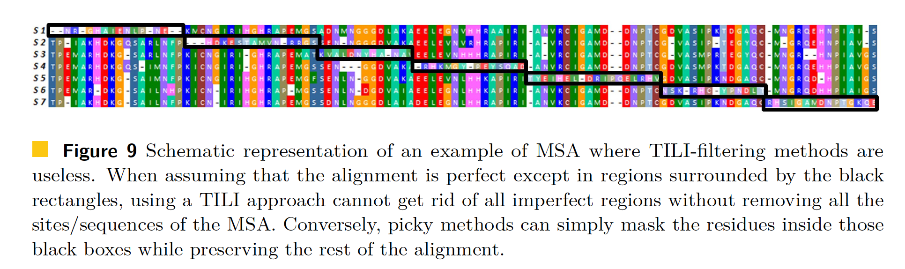
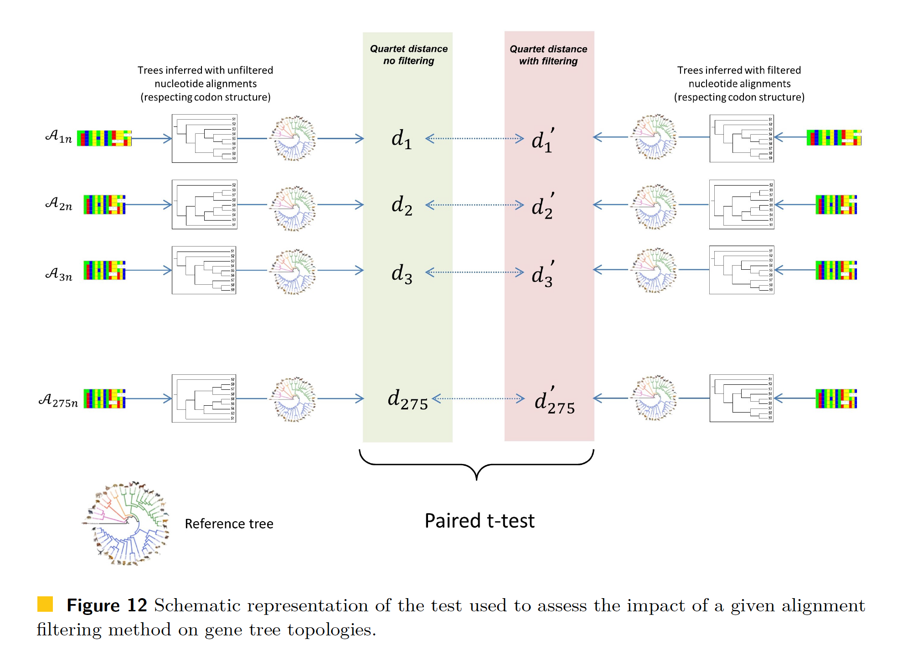
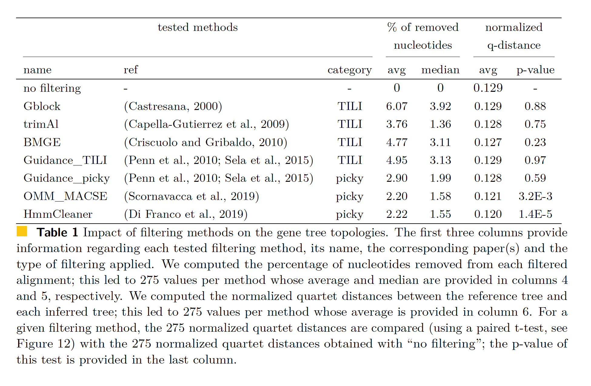
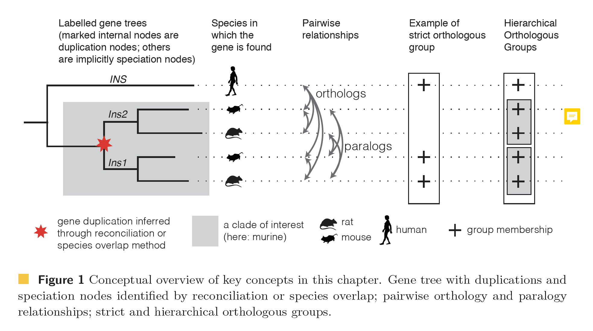

class: left, top

### Previous class check-up
- We studied the algorithms for multiple sequence alignment: Needleman-Wunsch, progresive alignment and improvements
- We learned about three software for MSA: muscle, t-coffee, clustalw

### Learning objectives

At the end of today's session, you will be able to
- highlight the main differences among MSA filtering methods
- compare the difference methods for orthology inference

### Pre-class work

- Read the paper corresponding to your group (in canvas):
  - [ClustalW](https://www.ncbi.nlm.nih.gov/pmc/articles/PMC308517/)
  - [MUSCLE](https://academic.oup.com/nar/article/32/5/1792/2380623)
  - [T-Coffee](https://www.sciencedirect.com/science/article/pii/S0022283600940427)
- Read HAL 2.2 (optional)
- Read HAL 2.4 (optional)

---
class: left, top

### Project checklist: heavy HW on your data starting now

- Until now:
  - Created your project github repo
  - Added the link to the `class-repos.md` via pull request
  - Added me as collaborator on your github repo (slack msg)
  - Data chosen and added 1 slide about it to the [shared google slides](https://docs.google.com/presentation/d/1UW6P5wVKcDLwVLoshnJ2ilTbrsUEPFoH1MTXppQcpAc/edit#slide=id.g10fe071e574_0_0)
      - Don't wait on your data: you can use public data because you will be creating scripts to use later on the "real" data
  - Added a description about your data in your `notebook-log.md` (or similar reproducible script) in your github repo and pushed
  - QC on your data: not perfect/complete, but at least a plan pushed to your github repo
- Next item: 
  - Alignment work pushed to your github repo by March 2nd, 2022

### Expectations as we move forward to heavy HW on your data
- You will be working on your data alone:
  - Troubleshooting with different data formats
  - Troubleshooting with software installation for your operating system
- Actively ask questions!
  - Slack
  - Office hours

---
class: left, top

# In-class discussion

**Objective:** Understand the main algorithms, assumptions and limitations of three widely used MSA software.

**Instructions:**

1. Separate group discussions (15 minutes): Students will discuss with their respective groups and prepare a 10-minute presentation for the whole class. Use these google slides:
  - [ClustalW](https://docs.google.com/presentation/d/1vtegUr8V5Q3Cf-L9Q_RQKyeml1AVPejaHnNhIi5cNOA/edit?usp=sharing)
  - [MUSCLE](https://docs.google.com/presentation/d/1u9JyRZ-xwta4iCY0Dk4ZiyYzjOU02xMHqoON7HYP4Lg/edit?usp=sharing)
  - [T-Coffee](https://docs.google.com/presentation/d/1tFc-VL_lH3FEBXHdR8RQ7OB5imfiWIx-oyBWPS4Aaf0/edit?usp=sharing)

2. Group presentations (30 minutes total; 10 minutes per group): Each group will summarize their discussion in a 10-minute presentation to the class.

---
class: left, top

# Filtering alignments (HAL 2.2)

- MSA is messy and error-prone, so many times we need to filter out poorly aligned regions
- We need to make sure that we do not remove signal along with the noise
- The balance depends on the planned downstream analysis: 
  - Example: misaligned regions impacting a single sequence at one time will have little impact on the phylogeny inference apart from terminal branch length estimations, but they will induce many false positives when searching for loci under positive selection
- For reproducibility reasons, we want automatic MSA cleaning methods, not manual, but there are no options yet
- Two types of filtering methods:
    - (take it or leave it) TILI-filtering methods: remove whole sites or whole sequences
    - masking residues: replace by gap or a symbol representing ambiguity ?,N,X (picky-filtering methods)

---
class: left, top

### What are the problematic regions of an aligment?

---
class: left, top

### What are the problematic regions of an aligment?

1. poorly informative
  - patchy: too many gaps (Fig 8a HAL)
  - regions in the vicinity of patchy regions (Fig 8b HAL)

2. wrongly aligned
  - misaligned regions (Fig 8c HAL)
  - low complexity regions with repeated characteristics (Fig 8d HAL)

---
class: left, top

### What causes problematic MSA regions?
- Highly divergent or non-homologous sequence fragments
    - Note that even when sequences are too divergent, or not even homologous, MSA software will still produce an alignment
    - Somewhere along the gradient from highly similar sequences to highly divergent sequences,
there is a critical point beyond which to align sequences is not possible, or biologically
meaningful: too many substitutions or indels have occurred

- High-throughput sequencing or annotation errors 
    - Sequencing errors -> small indels in nucleotide alignments -> errors in translation
    - Errors in homology annotation can lead to the inclusion of sequences that are not homologous
    - All sequences are homologous but some are erroneously considered as being
orthologous (derived from ancestral copy by speciation) while actually being paralogous
(derived from ancestral copy by duplication)

---
class: left, top

### Principles underlying filtering methods

- Gaps indicate hard to align and possibly saturated regions 
    - From a biological viewpoint, it is often assumed that in proteins insertions and deletions are less frequent than point substitutions

- Few/similar residues are expected per site
- Reliable regions are likely more robust to MSA method variations

- Homologous (fragment of) sequences are expected to be similar (pre-filtering)
    - For most pipelines, sequence similarity is an initial criterion used to identify homologous sequences

---
class: left, top

### TILI-filtering methods vs masking residues methods

- TILI-filtering methods are fated to remove signals along with noise
- TILI-filtering methods could still do a great job regarding phylogeny inference if they are able to correctly identify and remove sequences and sites containing more noise than signal
- In general, masking residues methods are better

---
class: left, top

## Comparison of filtering methods

---
class: left, top

## Comparison of filtering methods

- [OMM_MACSE pipeline](https://github.com/ranwez/MACSE_V2_PIPELINES) and [HmmCleaner](https://metacpan.org/pod/distribution/Bio-MUST-Apps-HmmCleaner/bin/HmmCleaner.pl) among the best filtering methods in this study
  - Journal club: [DiFranco et al, 2019, hmmCleaner](https://bmcecolevol.biomedcentral.com/articles/10.1186/s12862-019-1350-2)

---
class: left, top

# Orthology detection (HAL 2.4)

## Homology subtypes

- All life on earth shares a common origin
- Homologous genes: share ancestry
- We want to distinguish more precisely how homologous genes are related, giving rise to different homology subtypes
  - orthologs: speciation
  - paralogs: duplication
  - ohnologs: whole genome duplication
  - homoelogs: hybridization
  - xenologs: lateral gene transfer
- We mostly focus on orthologs due to their importance in phylogenomics
- Orthology can be a one-to-one relationship, a one-to-many, or many-to-one relationship
- Orthology and paralogy relationships are not transitive (see next figure)

---
class: left, top

# Orthologous groups

_Figure 1 in HAL 2.4_

---
class: left, top

# Orthologous groups: Figure summary

- Orthology can be a one-to-one, a one-to-many, a many-to-one, or many-to-many relationship
  - Example: a mammal gene in the human lineage and duplicated in the rodent lineage. Both rodent paralogous copies are orthologous to the human gene
- Orthology and paralogy relationships are not transitive
  - Example: mouse has two insulin genes Ins1 and Ins2, which duplicated within the rodent lineage. Human has one copy, INS. Therefore, Ins1 is orthologous to INS, INS is orthologous to Ins2, but Ins1 is not orthologous but paralogous to Ins2
- There are different types of orthologous groups: strict ortholog groups (transitive) and hierarchical orthologs groups
- Hierarchical orthogroups are obtained by the speciation nodes on the reconciled gene trees
  - "Reconciled gene trees": internal nodes labelled as speciation or duplication (HAL 3.2)
- Here, we will not worry on the reconciliation step and will focus on identifying and using orthologs

---
class: left, top

# Orthology inference methods

- Bidirectional Best Hit (BBH)
- Reciprocal Smallest Distance (RSD)
- Tree-based methods
- Graph-based methods

**Important readings:**  
- _The Impact of Gene Duplication, Insertion, Deletion, Lateral Gene Transfer and Sequencing Error on Orthology Inference: A Simulation Study_ [Dalquen et al 2013](https://journals.plos.org/plosone/article?id=10.1371/journal.pone.0056925)
- Journal club: _A New Orthology Assessment Method for Phylogenomic Data: Unrooted Phylogenetic Orthology_ [Ballesteros and Hormiga, 2016](https://academic.oup.com/mbe/article/33/8/2117/2578877?login=true)

---
class: left, top

# Orthology inference methods

### Bidirectional Best Hit (BBH)
- Also found as "reciprocal best hit"
- Call as orthologs all pairs of genes between two species that are more similar (i.e., with highest alignment score) to one another than to any other gene in the other species
- In BLAST: gene _i_ in genome _I_ is BBH of gene _j_ in genome _J_ if query of genome _I_ with gene _j_ hits gene _i_ and viceversa
- Learn more:
  - Original paper: [Overbeek et al 1999](https://www.ncbi.nlm.nih.gov/pmc/articles/PMC15866/)
  - Bidirectional Best Hits miss many orthologs in duplication-rich clades such as plants and animals [Dalquen & Dessimoz, 2013](https://www.ncbi.nlm.nih.gov/pmc/articles/PMC3814191/)

---
class: left, top

# Orthology inference methods

### Reciprocal Smallest Distance (RSD)

- It relies on global sequence alignment and maximum likelihood estimation of evolutionary distances to detect orthologs between two genomes
- Original paper [Wall et al, 2003](https://academic.oup.com/bioinformatics/article/19/13/1710/224944)
- Steps:
  1. You have gene _i_ from genome _I_ and target genome _J_
  2. With BLAST, identify a set of hits _H_ above a predefined significance threshold
  3. Use ClustalW to pairwise align every sequence in _H_ with gene _i_
  4. If the alignment score is greater than a threshold, the sequence _h_ is kept (call this set of hits _H2_)
  5. Using PAML, you calculate the maximum likelihood evolutionary distance between every sequence in _H2_ and gene _i_ based on a given model of evolution
  6. The sequence with the minimim evolutionary distance to gene _i_ is identified as the ortholog
  

---
class: left, top

# Orthology inference methods

### Tree-based methods
- Tree-based orthology inference methods
reconstruct a gene tree for a group of homologous sequences to then infer the type of
evolutionary event represented by each internal node of the tree
- To label the trees, there are two options:
  - gene tree/species tree reconciliation methods (HAL 3.2)
  - species overlap: duplication nodes have the same species represented in child subtrees
- Software: 
  - PANTHER, GIGA, EmsembleCompara use reconciliation approach
  - PhylomeDB, MetaPhOrs, ETE library use the species overlap approach

---
class: left, top

# Orthology inference methods

### Graph-based methods
- Avoid inferring trees and instead
compare sequences in a pairwise fashion, and build a graph with genes as nodes and some
measure of sequence similarity as edges
- Assumption: orthologs tend to be the pairs of sequences that have diverged the least
- Rely on computational approaches to identify clusters in the graph to be considered the orthologous groups
- Software: Inparanoid, OMA, OrthoMCL, OrthoFinder, OrthoInspector, QuartetS

---
class: left, top

# Orthology inference methods

### Graph-based methods

---
class: left, top

### MCL algorithm

Learn more: [MCL slices](https://sites.cs.ucsb.edu/~xyan/classes/CS595D-2009winter/MCL_Presentation2.pdf) and [MCL tutorial](https://micans.org/mcl/).

---
class: left, top

# Impact on phylogenomics inference

- Initially, there was no need to search for orthologs
  - The experimental design in molecular phylogenetics included the identification
of highly conserved regions in the organismal lineage of interest, that were amplified by PCR. As the same marker gene
 (i.e. the orthologous gene) was specifically sequenced from each of the species of interest,
there was no need to search for orthologs

- High-throughput sequencing and the availability of complete (or nearly complete)
genomes and transcriptomes allow us in principle to choose among virtually any marker gene.
In these cases, there is a need of inferring orthologous genes from the source genomic datasets

- Few studies have compared how sets of orthologs inferred through different methods vary and how it
affects species tree reconstruction, but see [Dalquen et al 2013](https://journals.plos.org/plosone/article?id=10.1371/journal.pone.0056925) and [Nichio et al 2017](https://www.frontiersin.org/articles/10.3389/fgene.2017.00165/full)

---
class: left, top

# Homework: ortholog method for your data

**Instructions:**
1. Read the review paper on new tools in orthology analysis: [Nichio et al 2017](https://www.frontiersin.org/articles/10.3389/fgene.2017.00165/full)
2. Choose one orthology method that you like the best on your project dataset and read the paper for this method
  - Don't forget to include in your reproducible script a short description of the chosen algorithm, its assumptions and limitations (see the [software cheatsheet](https://github.com/crsl4/phylogenetics-class/blob/master/exercises/software-cheatsheet.md))
  - Make sure to keep notes in your reproducible script and keep the most updated version on github (it is important to push your work to github since this allows me to check what you are doing and offer suggestions)
3. Add one slide describing the chosen method to share with the class in the [class google slides](https://docs.google.com/presentation/d/1iZVRWdLQ2wrdACiF06LhFKDVqe1H8WLMNwgsunofjy4/edit?usp=sharing)
4. Submit the link to your github commit in canvas

**Deadline:** March 9th, 2022

---
class: left, top

# Final project datasets

Let's check the different datasets that will be used in the final projects:
[google slides](https://docs.google.com/presentation/d/1UW6P5wVKcDLwVLoshnJ2ilTbrsUEPFoH1MTXppQcpAc/edit?usp=sharing)

---
class: left, top

# Further reading

- Learn more about the [Quest for Orthologs](https://questfororthologs.org/) meeting
- Read about BBH in the original paper [Overbeek et al 1999](https://www.ncbi.nlm.nih.gov/pmc/articles/PMC15866/) and its limitations [Dalquen & Dessimoz, 2013](https://www.ncbi.nlm.nih.gov/pmc/articles/PMC3814191/)
- Read Inferring Orthologs: Open Questions and Perspectives in [Tekaia2016](https://journals.sagepub.com/doi/10.4137/GEI.S37925)
- Read Finding Orthologs in the Twilight and Midnight Zones of Sequence Similarity in [Haberman2016](https://link.springer.com/chapter/10.1007%2F978-3-319-41324-2_22)

---
class: left, top

# Summary of the three software (reading at home)

### Progressive alignment: [Thompson, 1994, ClustalW](https://www.ncbi.nlm.nih.gov/pmc/articles/PMC308517/)

- pairwise alignment to create distance matrix and then tree based on NJ
- sequences are down-weighted compared to how closely related they are to other sequences (to avoid a group of similar sequences to dominate the alignment)
- different weight matrices are used: 1) for closely related sequences where high scores are given to identities and low scores ow; 2) for distantly related sequences where high scores are given to conservative amino acid matches and low score to identities (BLOSUM, PAM matrices)
- the program varies the gap penalties (GP) for sequences and positions
- most widely used option, but several methods have been shown more accurate and fast
- Downsides
  - The guide tree has a big impact on alignments (and we usually estimate an inaccurate tree). Some ways to overcome this issue are
      - better ways to estimate the tree (maximum likelihood); not very scalable
      - iteration between tree and alignment; not very scalable
  - Errors made early in the process persist since subsequent mergers never change the alignments they are merging together

---
class: left, top

### Iterative refinement: [Edgar, 2004, MUSCLE](https://academic.oup.com/nar/article/32/5/1792/2380623)

- outperforms ClustalW in most settings but it is less scalable
- [MAFFT](https://mafft.cbrc.jp/alignment/software/algorithms/algorithms.html) also performs iterative refinement

### Consistency-based scoring: [Notredame, 2000, T-Coffee](https://www.sciencedirect.com/science/article/pii/S0022283600940427)
- consistency-based scoring: overcomes progressive alignment local-minimum problem
- uses "weighted sum of pairs" (WSP) objective function; we want to find the MSA that maximizes the score of the alignments (or minimizes the cost)
- Sum-of-pairs alignment
  - the cost of a given multiple sequence alignment is defined by summing the costs of its site of induced pairwise alignments
  - given input set S of sequences and the function for computing the cost of any pairwise alignment, find an alignment A on S such that the sum of the induced pairwise alignments is minimized
- uses intermediate sequences to improve the quality of the pairwise alignment. For example, we are aligning sequences A and C and get a pairwise alignment A-C. We need incorportate an intermediate sequence B, and pairwise A-B and B-C to then obtain the pairwise alignment (A-C)
- generally more accurate than Clustalw; but not scalable to large alignments
