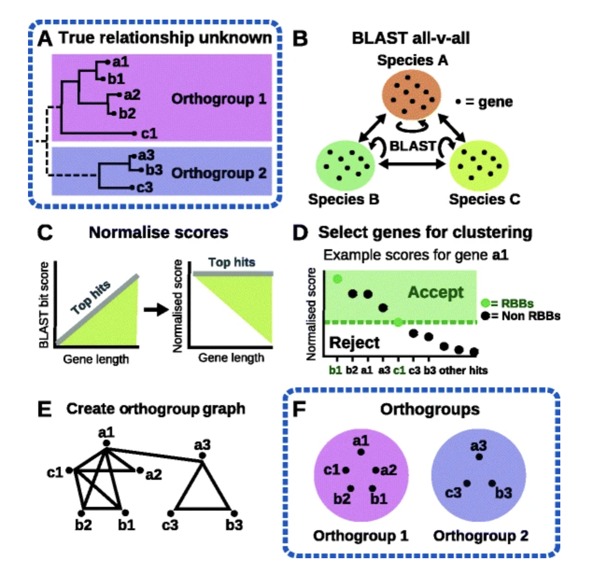

class: left, top

# Lecture 6

### Previous class check-up
- We studied the algorithms for multiple sequence alignment: Needleman-Wunsch, progresive alignment and improvements
- We learned about three software for MSA: muscle, t-coffee, clustalw

### Learning objectives

At the end of today's session, you will be able to
- compare the difference methods for orthology inference
- describe the steps in the OrthoFinder algorithm
- run OrthoFinder in your computer

### Pre-class work

- Read HAL 2.4
- Read [OrthoFinder paper](https://genomebiology.biomedcentral.com/articles/10.1186/s13059-015-0721-2)

---
class: left, top

# Homology subtypes

- All life on earth shares a common origin
- Homologous genes: share ancestry
- We want to distinguish more precisely how homologous genes are related, giving rise to different homology subtypes
  - orthologs: speciation
  - paralogs: duplication
  - ohnologs: whole genome duplication
  - homoelogs: hybridization
  - xenologs: lateral gene transfer
- We mostly focus on orthologs due to their importance in phylogenomics
- Orthology can be a one-to-one relationship, or a one-to-many or many-to-one relationship
- Orthology and paralogy relationships are not transitive

---
class: left, top

# Orthologous groups

_Figure 1 in HAL 2.4_

---
class: left, top

# Orthologous groups
- Orthology can be not only a one-to-one relationship, but also a one-to-many, many-to-one or many-to-many relationship: Consider e.g. a mammal gene retained in the human lineage and duplicated in the rodent lineage. Consider furthermore that one mouse copy has remained in its ancestral locus and the other one has moved elsewhere in the genome. Both rodent paralogous copies are orthologous to the human gene
- Orthology and paralogy relationships are not transitive: For instance, mouse has two insulin genes Ins1 and Ins2, which duplicated within the rodent lineage. Human has one copy, INS. Therefore, Ins1 is orthologous to INS, INS is orthologous to Ins2, but Ins1 is not orthologous but paralogous to Ins2
- There are different types of orthologous groups: strict ortholog groups (transitive) and hierarchical orthologs groups
- "reconciled gene trees": internal nodes labelled as speciation or duplication (HAL 3.2)
- hierarchical orthogroups are obtained by the speciation nodes on the reconciled gene trees
- Here, we will not worry on the reconciliation step and will focus on identifying orthologs (and removing others)

---
class: left, top

# Orthology inference methods

### Tree-based methods
- Tree-based orthology inference methods
reconstruct a gene tree for a group of homologous sequences to then infer the type of
evolutionary event represented by each internal node of the tree
- To label the trees, there are two options:
  - gene tree/species tree reconciliation (chapter 3.2)
  - species overlap: duplication nodes have the same species represented in child subtrees
- Software: 
  - PANTHER, GIGA, EmsembleCompara use reconciliation approach
  - PhylomeDB, MetaPhOrs, ETE library use the species overlap approach

---
class: left, top

# Orthology inference methods

### Graph-based methods
- Avoid inferring trees and instead
compare sequences in a pairwise fashion, and build a graph with genes as vertices and some
measure of sequence similarity as edges
- based on comparisons between pairs of genes within and between
species
- orthologs tend to be the pairs of sequences that have diverged the least
- large-scale orthology prediction approaches:
  - the basic
"bidirectional best hit" (BBH) approach: which considers the pairs with
mutually highest alignment scores
  - "reciprocal shortest distance" (RSD) approach: phylogenetic distance-based
- Weaknesses:
  - BBH and RSD do not deal well with many-to-many orthology relationships,
resulting in missing pairs
  - BBH and RSD can fail in case of differential gene loss: a situation where
the corresponding ortholog is simply missing in both species, resulting in paralogs being wrongly identified as orthologs
    - solution: "witnesses of non-orthology" third party species that retained both copies (OMA algorithm)
  - BBH and RSD do not obviously generalise to groupwise orthology (COGs: clusters of orthologous groups)

---
class: left, top

# Impact on phylogenomics inference

- Initially, the experimental design in molecular phylogenetics included the identification
of highly conserved regions in the organismal lineage of interest, that were amplified with
specific probes by means of a polymerase chain reaction (PCR). As the same marker gene
–i.e. the orthologous gene–was specifically sequenced from each of the species of interest,
there was no need to search for orthologs

- High-throughput sequencing and the availability of complete (or nearly complete)
genomes and transcriptomes, one can in principle choose among virtually any marker gene.
In these cases, there is a need of inferring orthologous genes from the source genomic datasets

- Few studies have compared how sets of orthologs inferred through different methods vary and how it
affects species tree reconstruction

---
class: left, top

# OrthoFinder

- Paper [Emms and Kelly, 2015](https://genomebiology.biomedcentral.com/articles/10.1186/s13059-015-0721-2)
- [Github repo](https://github.com/davidemms/OrthoFinder)

- Why OrthoFinder?  
  - infers "orthogroups": an orthogroup is the set of genes that are descended from a single gene in the last common ancestor of all the species being considered. An orthogroup by definition contains both orthologues and paralogues
  - A standard OrthoFinder run produces a set of files describing the orthogroups, orthologs, gene trees, resolve gene trees, the rooted species tree, gene duplication events and comparative genomic statistics for the set of species being analysed
  - In some simulations, OrthoFinder outperforms OrthoMCL which is one of the most cited orthology inference methods

---
class: left, top

# Before the OrthoFinder algorithm...

Let's talk about graph clustering algorithms

---
class: left, top

# OrthoFinder algorithm

_Figure 7 in Emms and Kelly (2015)_

---
class: left, top

# OrthoFinder algorithm

1) BLAST all-versus-all search (Fig. 7b)
  - Protein BLAST (blastp) with an e-value threshold of 10−3 is used so as to avoid discarding putative good hits for very short sequences
  - A relaxed threshold is used at this stage of the method as subsequent steps filter out false positive hits using stringent, orthogroup-specific criteria for inclusion (described below)
  - Note: BLAST E-value is the number of expected hits of similar quality (score) that could be found just by chance. E-value of 10 means that up to 10 hits can be expected to be found just by chance, given the same size of a random database.

---
class: left, top

# OrthoFinder algorithm

2) Gene length and phylogenetic distance normalisation of the BLAST bit scores (Fig. 7c). 
  - The aim of this normalisation procedure is to remove gene length bias from BLAST bit scores and to normalise for phylogenetic distance between species
  - This step models the all-vs-all BLAST hits for each pairwise comparison between species to identify and remove the gene similarity dependency on gene length and phylogenetic distance
  - This is done so that the best hits between all species achieve the same scores regardless of sequence length or phylogenetic distance
  - The clustering algorithm that they use (MCL) converts sets of similarity scores into clusters by breaking apart clusters of genes that have low similarity scores (and therefore are unlikely to be orthogroups) and preserving clusters of sequences that have high similarity scores. If the similarity scores between long sequences are inherently larger than the similarity scores between short sequences then the clustering will preferentially break apart clusters of short sequences while preserving clusters of long sequences
  
---
class: left, top

# OrthoFinder algorithm

3) Delimitation of orthogroup sequence similarity thresholds using RBNHs (Fig. 7d)
  - We construct a similarity measure between sequences based on the bit-score normalised to take into account the query and hit sequences lengths and the phylogenetic distance between species
  - This step uses information from RBNHs (Reciprocal Best length-Normalised hit) to define the lower limit of sequence similarity for putative cognate genes of each query gene
  - To be included in the orthogroup graph a gene-pair must be an RBNH or produce a hit that is better scoring than the lowest scoring RBNH (irrespective of species) for either gene

4) Constructing an orthogroup graph for input into the clustering algorithm (MCL) (Fig. 7e)
  - Putative cognate gene-pairs are identified as above and are connected in the orthogroup graph with weights given by the normalised BLAST bit scores.

5) Clustering of genes into orthogroups using the clustering algorithm [MCL](https://www.micans.org/mcl/index.html?sec_software) (Fig. 7f)

---
class: left, top

# In-class activity

**Time:** 25 minutes

**Instructions:** Go over the [OrthoFinder Tutorial](https://davidemms.github.io/menu/tutorials.html) and create our own reproducible script.

**Disclaimer:** I have not done the steps ahead of time to make sure that everything runs smoothly. My idea is to troubleshoot this pipeline together, but maybe this will backfire.

#### Options for you

1. "I think that I can follow the pipeline by myself or with a small group of peers": you should join the Congregate room
2. "I need to see step by step": you can stay here in the zoom room

---
class: left, top

# In-class discussion (if time allows)

**Time:** 10 minutes individual/small-group work and 5 minutes class discussion

**Instructions:**
Now that you have a better idea of the OrthoFinder algorithm, what do you think are the main weaknesses of this (or similar) software? What assumptions are they making?

Use the 
[Google slides](https://docs.google.com/presentation/d/177UUJovYy18neX03vRHxoxvUqvL0hKUYrecS6q4GO-0/edit?usp=sharing) to record your answer. Feel free to group in teams in Congregate.

---
class: left, top

# Further reading

- Read again the [OrthoFinder paper](https://genomebiology.biomedcentral.com/articles/10.1186/s13059-015-0721-2) and read also the [extension](https://genomebiology.biomedcentral.com/articles/10.1186/s13059-019-1832-y)
- Check out more on the [OrthoFinder github repo](https://github.com/davidemms/OrthoFinder)
- Learn more about the [Quest for Orthologs](https://questfororthologs.org/) meeting
- Read [Tekaia2016](https://journals.sagepub.com/doi/10.4137/GEI.S37925)
- Read [Haberman2016](https://link.springer.com/chapter/10.1007%2F978-3-319-41324-2_22)

