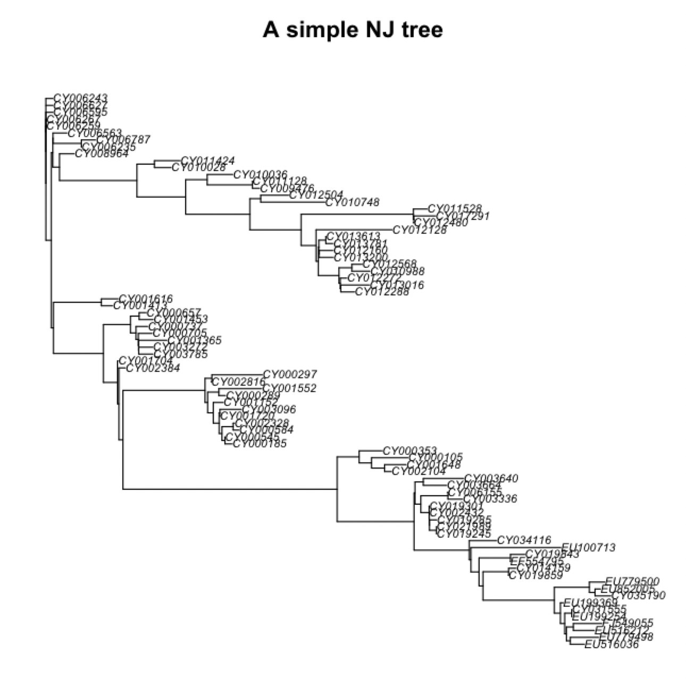

# Distance and Parsimony methods (Part 3: computer lab)

# Software R package _ape_: Distance-based methods

- _ape_ is one of the most widely used phylogenetic software
- It is an R package and it has a huge variety of functions
- In particular, today we will use it for distance-based tree estimation methods
- [Full documentation](http://ape-package.ird.fr/)
- We will follow this [great tutorial](https://adegenet.r-forge.r-project.org/files/MSc-intro-phylo.1.1.pdf)

## In-class group dynamic

**Time:** 20 minutes

**Instructions:** 
1. Follow the R commands to obtain a ME tree from the sample data (or your own data!). The commands are listed in the [PDF tutorial](https://adegenet.r-forge.r-project.org/files/MSc-intro-phylo.1.1.pdf) that we are using as guideline, in our reproducible script [notebook-log.md](https://github.com/crsl4/phylogenetics-class/blob/master/exercises/notebook-log.md) and on the following slides.
2. After the allotted time, we will compare our work all together.

## Solution

1) Installing necessary packages:
```r
install.packages("adegenet", dep=TRUE)
install.packages("phangorn", dep=TRUE)
```

2) Loading the packages
```r
library(ape)
library(adegenet)
library(phangorn)
```

3) Loading the sample data
```r
dna <- fasta2DNAbin(file="http://adegenet.r-forge.r-project.org/files/usflu.fasta")
```

4) Computing the genetic distances. They choose a Tamura
and Nei 1993 model which allows for different rates of transitions and transversions, heterogeneous base frequencies, and between-site variation of the substitution rate (more on Models of Evolution).
```r
D <- dist.dna(dna, model="TN93")
```

5) Get the NJ tree
```r
tre <- nj(D)
```

6) Before plotting, we can use the [`ladderize` function](https://rdrr.io/cran/ape/man/ladderize.html) which reorganizes the internal structure of the tree to get the ladderized effect when plotted
```r
tre <- ladderize(tre)
```


7) We can plot the tree
```r
plot(tre, cex=.6)
title("A simple NJ tree")
```

<div style="text-align:center"></div>


{: .highlight }
How do we interpret the tree?

## Summary of Software R package _ape_

Main distance functions:
- `nj` (`ape` package): the classical Neighbor-Joining algorithm.
- [`bionj`](https://www.rdocumentation.org/packages/ape/versions/5.4-1/topics/BIONJ) (`ape`): an improved version of Neighbor-Joining: [Gascuel 1997](https://pubmed.ncbi.nlm.nih.gov/9254330/). It uses information on variances of evolutionary distances
- [`fastme.bal` and `fastme.ols`](https://www.rdocumentation.org/packages/ape/versions/5.4-1/topics/FastME) (`ape`): minimum evolution algorithms: [Desper and Gascuel, 2002](https://pubmed.ncbi.nlm.nih.gov/12487758/)
- `hclust` (`stats`): classical hierarchical clustering algorithms including single
linkage, complete linkage, UPGMA, and others.


# Software: R package _phangorn_: Parsimony-based methods

- _phangorn_ is another widely used phylogenetic software
- It is an R package and it has a huge variety of functions
- In particular, today we will use it for parsimony-based tree estimation methods
- [Full documentation](https://cran.r-project.org/web/packages/phangorn/vignettes/Trees.pdf)
- We will follow this [great tutorial](https://adegenet.r-forge.r-project.org/files/MSc-intro-phylo.1.1.pdf)

## In-class group dynamic

**Time:** 20 minutes

**Instructions:** 
1. Follow the R commands to obtain a MP tree from the sample data (or your own data!). The commands are listed in the [PDF tutorial]((https://adegenet.r-forge.r-project.org/files/MSc-intro-phylo.1.1.pdf)) that we are using as guideline or in our reproducible script [notebook-log.md](https://github.com/crsl4/phylogenetics-class/blob/master/exercises/notebook-log.md) or on the following slides.
2. After the allotted time, we will compare our work all together.

## Solution

1) Installing necessary packages (if you have not installed them for the distance section above)
```r
install.packages("adegenet", dep=TRUE)
install.packages("phangorn", dep=TRUE)
```

2) Loading
```r
library(ape)
library(adegenet)
library(phangorn)
```

3) Loading the sample data and convert to phangorn object:
```r
dna <- fasta2DNAbin(file="http://adegenet.r-forge.r-project.org/files/usflu.fasta")
dna2 <- as.phyDat(dna)
```

4) We need a starting tree for the search on tree space and compute the parsimony score of this tree (422)
```r
tre.ini <- nj(dist.dna(dna,model="raw"))
parsimony(tre.ini, dna2)
```

5) Search for the tree with maximum parsimony:
```r
> tre.pars <- optim.parsimony(tre.ini, dna2)
Final p-score 420 after  2 nni operations
```

6) Plot tree:
```r
plot(tre.pars, cex=0.6)
```

# Further learning:
Continue the parsimony steps in the [PDF tutorial](https://adegenet.r-forge.r-project.org/files/MSc-intro-phylo.1.1.pdf) on the same sample data.


# Homework

See the details of the Distance and Parsimony HW in [here](https://github.com/crsl4/phylogenetics-class/blob/master/exercises/hw-dist.md). 

