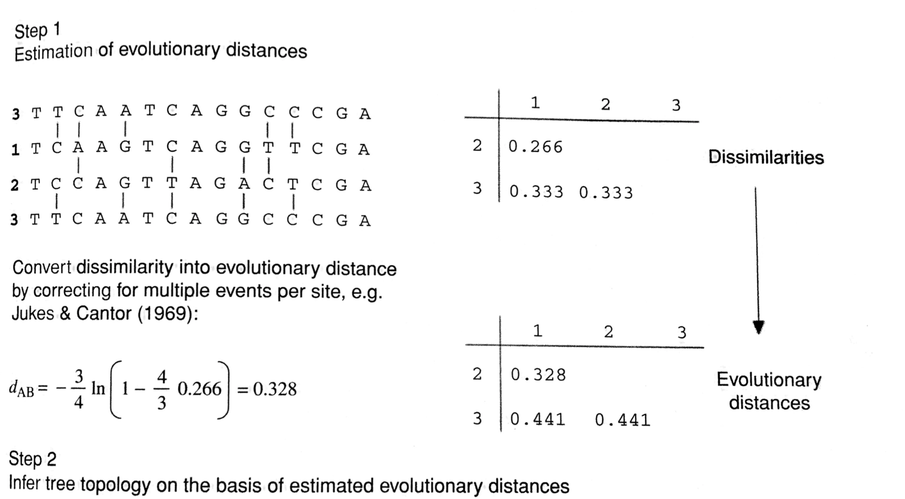
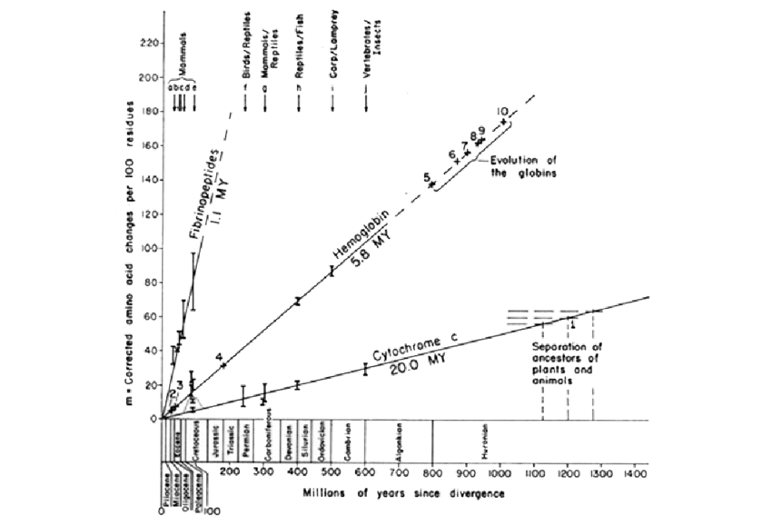

# Distance and Parsimony methods (Part 1)

### Previous class check-up
- We studied the overview of phylogenetic inference and the main challenges

### Learning objectives

At the end of today's session, you will be able to
- explain both algorithms to reconstruct trees: 1) based on distances and 2) based on parsimony
- assess the strenghts and weaknesses of every approach
- use R for tree estimation based on distances or parsinomy

### Pre-class work

- Optional readings: HB Ch 5-6, Baum Ch 7-8

{: .highlight }
**Final project datasets:** First, let's check the different datasets that will be used in the final projects (google slides link in canvas).

{: .note }
**Phylogenetic inference:** Step 1) Choose the criterion to use: distances, parsimony, likelihood. Step 2) Search the space of trees until you find the optimum

# Phylogenetic methods

|  | Character-based methods | Non-character-based methods | 
| :---:   | :---: | :---:       | 
| Based on an explicit model of evolution | Likelihood methods | Distance methods |
| Not based on an explicit model of evolution | Parsimony methods | |

# Distance-based methods

{: .highlight }
**Goal:** Fit a tree to a matrix of pairwise genetic distances

## Computing the distances
- For every two sequences, the distance corresponds to the fraction of positions in which the two sequences differ (p-distance)
- The p-distance underestimates the true genetic distance $d$
- Thus, we do not use the p-distances as the pairwise distances but instead we estimate the number of substitutions that occurred by applying a specific evolutionary model


<div style="text-align:center"></div>

_Figure 5.2 in HB 5_


- We will assume that the genetic distances have been estimated using an appropriate evolutionary model (more on Lectures 9 and 12)
- The main distance-based tree building methods are:
  - cluster analysis
  - minimum evolution
- **Advantage of distance-based methods over parsimony or likelihood:** There are algorithms that produce the optimum tree without having to search the space of trees
  - Pros: You can get the tree in a scalable manner regardless of sample size
  - Cons: 
      - Algorithmic methods tend to be approximations, so they would approximate the optimum tree, but rarely achieve it
      - However, keep in mind that searching the space would not necessarily achieve the optimum either because many times the search is not exhaustive
    

## Cluster analysis

- Constructs ultrametric trees (rooted trees in which all the end nodes are equidistant from the root)
- Only possible assuming a **molecular clock**:
  - Zuckerland and Pauling published two fundamental papers on the evolutionary rate of proteins
  - They noticed that the genetic distance of two sequences coding for the same protein on different species seems to increase linearly with divergence time
  - This seems to imply that the rate of evolution for any given protein is constant: existence of a molecular clock
  - This assumption is used for dating the divergences in the tree
  - The molecular clock assumption aligns with the neutral theory of evolution (vs positive selection theory) and implies that deviations from clock-like behavior may reveal adaptive evolution, relaxing functional constraints or changes in effective population size
  - How to test the clock hypothesis? HB 11
- Constructs ultrametric trees (rooted trees in which all the end nodes are equidistant from the root)
- Only possible assuming a **molecular clock**:

<div style="text-align:center"></div>

_Figure 11.1 in HB11_  

- Options for Cluster Analysis: 
  - UPGMA: unweighted-pair group methods with arithmetic means
  - WPGMA: weighted-pair group methods with arithmetic means
- Cluster analysis is extremely sensitive to unequal rates in different lineages


### UPGMA/WPGMA Algorithm

Input: Matrix of pairwise distances

1) Group together the two taxa with smallest distance (say A, B)

2) Compute the distance from AB to every other taxa

WPGMA: $d_{(AB)k} = \frac{d_{A,k}+d_{B,k}}{2}$ (simple average)

UPGMA: $d_{(AB)k} = \frac{N_A d_{A,k}+N_B d_{B,k}}{N_A + N_B}$ (averaged by number of taxa in the cluster)

3) Repeat until all taxa are clustered

{: .note }
We are not searching the space of trees here, this is an algorithm that returns a tree that agrees with the distances provided.


## Cluster analysis example

**In-class dynamic:** (_Box 5.1 in HB11_) Find the WPGMA tree for the distance matrix below.

```
   A  B  C  D  E  F 
A
B  2  
C  4  4 
D  6  6  6
E  6  6  6  4
F  8  8  8  8  8
```

Watch again in [YouTube video](https://youtu.be/jLQAwlODdCo).


## Minimum evolution
- We want to reconstruct a tree with minimum length
- The length of the tree is inferred from the genetic distances
- It does not reconstruct ultrametric trees, but additive trees
- An additive tree is a tree that satisfies the four-point metric condition: $d_{AB}+d_{CD} \leq max(d_{AC}+d_{BD},d_{AD}+d_{BC})$
- Additive trees are always a better fit to distances under non-clock-like behavior
- There is an algorithm to estimate the ME tree: neighbor-joining (NJ) [(Saitou and Nei, 1987)](https://pubmed.ncbi.nlm.nih.gov/3447015/)
- NJ tree is the same as the ME tree only if distances are additive to begin with, but it has been shown that the NJ tree can be very similar to the ME tree most of the times
- NJ is better that UPGMA/WPGMA under unequal rates of evolution


### NJ Algorithm

Input: Matrix of pairwise distances

1. Compute the net divergence $r$ (sum of distances) for every end node: $r_j = \sum_i d_{ij}$
2. Create a rate-corrected distance matrix: $M_{ij} = d_{ij} - \frac{r_i+r_j}{N-2}$
3. Define the new node that groups taxa $i$ and $j$ for which $M_{ij}$ is minimal (say A,B)
4. Compute the branch lengths from new node U to A and B: $S_{AU} = \frac{d_{AB}}{2} + \frac{r_A - r_B}{2(N-2)}$
5. Compute new distances from node U to every other end node: $d_{kU} = \frac{d_{Ak}+d_{Bk}-d_{AB}}{2}$
6. Repeat the steps


## Minimum evolution example

**Homework:** Find the NJ tree for the distance matrix below.

```
   A  B   C  D  E  F 
A
B  5  
C  4  7 
D  7  10  7
E  6  9   6  5
F  8  11  8  9  8
```

{: .warning }
_Box 5.2 in HB11:_ Note that there are many errors in the book.

**Solution:** See this [YouTube video](https://youtu.be/n1BEd05IpEk) with all the steps in the algorithm.


# Distance-based methods: Main conclusions
- Two steps
  1. genetic distances from a p-distance and a model of evolution
  2. a phylogenetic tree is constructed from the distances
- Distance methods reduce the phylogenetic information to one value per pair of sequences, so many times regarded as inferior compared to character-based methods (less stat power due to the loss of info)
- But unlike parsimony, they rely on an evolution model but the result will depend on which model is chosen (more on Lecture 9 and 12)
- They do not have the model flexibility as likelihood-based models
- Under standard conditions, NJ trees are meant to estimate accurate trees and they are very fast to be estimated
- However, these methods assume the distances are accurate. Noisy distances can affect the estimated tree
- Aside from the ME algorithm that aims to find the tree that minimizes the tree length, there are other ME algorithms that aim to find the tree that minimize the differences between the genetic distances and the tree distances (called OLS=ordinary least squares): $F = \sum_{i,j} (D_{ij}-d_{ij})^2$ where $D_{ij}$ are the tree distances and $d_{ij}$ are the observed genetic distances


